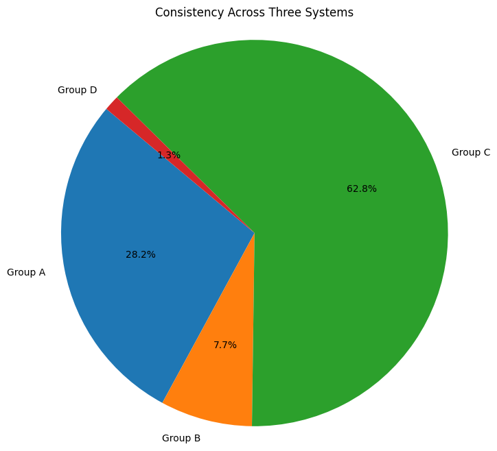
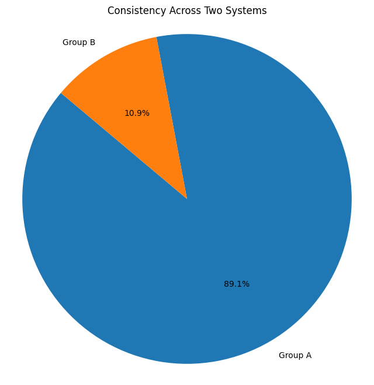
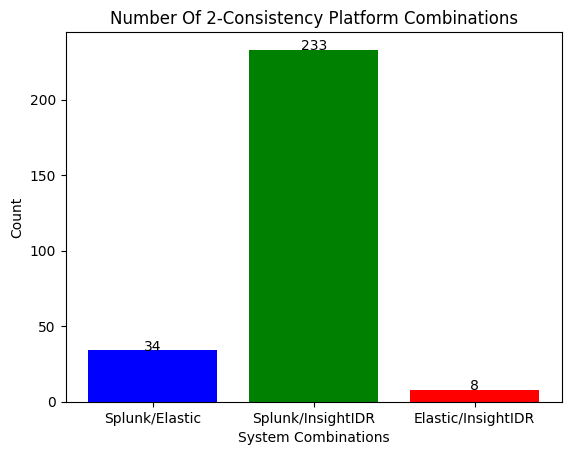
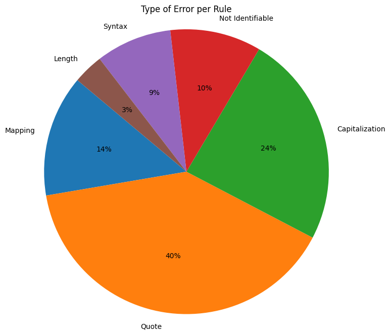

# Evaluation of Sigma rule consistency

### 1. Load the conductect data into python. 


```python
import pandas as pd
df = pd.read_json('../real-data-100.json')
print(df)
```

                                                  samples
    0   {'hash': 'a1ed46df50f5be3a6b3b291189d115bcccb9...
    1   {'hash': '13144b87810fe4739e4e7078968b49e7ca4b...
    2   {'hash': '8710679cc4055b4ed025b3be8a9b248a3ca4...
    3   {'hash': 'f9043ef5ec8506f52efd3f8e1f9dc53b8c51...
    4   {'hash': 'f636d54bf66339ab983cf31e259c8af64bdb...
    ..                                                ...
    95  {'hash': 'ee9cebf9aaeb69e2f70c588c551a85dbdb9c...
    96  {'hash': 'd509087303bb0f0d4710410f437844928d43...
    97  {'hash': 'c13ea062e1f95644caadecc45351ed4b7d9c...
    98  {'hash': '7b9e3a1daae553787702cc7245c8aa6d569c...
    99  {'hash': 'f93faf0aef75fd22d3d5358389b6c2857b91...
    
    [100 rows x 1 columns]


### 2. Display statistics for the loaded data. 


```python
print("Number of Malware Samples: ", len(df['samples']))
print("Number of Rules: ", len(df['samples'][0]['rules']))
```

    Number of Malware Samples:  100
    Number of Rules:  78


### 3. Evaluate the Sigma rules that are consistent across all three systems.

#### 3.1 Categorization of 3-consistency.

The results are categorized within the following groups:
* **Group A:** Always Consistent
* **Group B:** Sometimes Consistent
* **Group C:** Never Consistent
* **Group D:** Other


```python
consistent = {}
total_detection = {}

for malware in df['samples']:

    for rule in malware['rules']:
        # all 0 -> continue
        if rule['i'] == 0 and rule['e'] == 0 and rule['s'] == 0:
            continue
        
        if not total_detection.get(rule['title']):
            total_detection[rule['title']] = 1
        else:
            total_detection[rule['title']] += 1
        
        
        values = set({rule['i'], rule['e'], rule['s']})

    
        # all are the same 
        if len(values) == 1:

            # not in output because first time appeared
            if not consistent.get(rule['title']):
                consistent[rule['title']] = 1
            else:
                consistent[rule['title']] += 1


group_a = {} #always
group_b = {} #sometimes
group_c = {} #never
group_d = {} #other

for detection in total_detection:
    
    # if detection is consistent at least once add to group a or b
    if consistent.get(detection):
        tmp = {
                "consistent": consistent[detection],
                "total": total_detection[detection]
        }
        if consistent[detection] == total_detection[detection]:
            group_a[detection] = tmp
        else: 
            group_b[detection] = tmp

    else:
        group_c[detection] = {
            "consistent": 0,
            "total": total_detection[detection]
        }


for rule in df['samples'][0]['rules']:
      if rule['title'] not in total_detection.keys():
          group_d[rule['title']] = {
            "consistent": 0,
            "total": 0
        }

print("A: ", len(group_a))
print("------------------------")
print("B: ", len(group_b))
print("------------------------")
print("C: ", len(group_c))
print("------------------------")
print("D: ", len(group_d))
print("---------Total----------")
print(f"{len(group_a)+len(group_b)+len(group_c)+len(group_d)}")
```

    A:  22
    ------------------------
    B:  6
    ------------------------
    C:  49
    ------------------------
    D:  1
    ---------Total----------
    78


```python
import matplotlib.pyplot as plt

# Lengths of the lists
lengths = [len(group_a), len(group_b), len(group_c), len(group_d)]

# Labels for the pie chart
labels = ['Group A', 'Group B', 'Group C', 'Group D']

# Plotting the pie chart
plt.figure(figsize=(8, 8))
plt.pie(lengths, labels=labels, autopct='%1.1f%%', startangle=140)

plt.axis('equal')  # Equal aspect ratio ensures that pie is drawn as a circle.
plt.title('Consistency Across Three Systems')
plt.show()
```


    

    


#### 3.2 Classify the reason for inconsistent dectection rates for rules assigned to Group B

The classification process involved examining the generated table below and analyzing the results. By reviewing the Elastic-Total, Splunk-Total, and Insight-Total values alongside their corresponding detections, it was evident which rules failed due to inconsistent conversion and which ones were affected by data inconsistency.


```python
data = {
    "Rule": [],
    "Elastic-Total": [],
    "Splunk-Total": [],
    "Insight-Total": [],
    "e": [],
    "s": [],
    "i": [],
    "comment": [],
}

for i_rule, value in group_b.items():

    for malware in df['samples']:
    
        for rule in malware['rules']:
            if rule['i'] == 0 and rule['e'] == 0 and rule['s'] == 0:
                continue

            set_count = set([malware['s_events_total'], malware['e_events_total'], malware['i_events_total']])
            if len(set_count) == 1:
                #print(f"INCONSISTENT: s={malware['s_events_total']} | e={malware['e_events_total']} | i={malware['i_events_total']}  |  Rule: {rule}")
                continue

            if rule['s'] == rule['e'] and rule['s'] == rule['i'] and rule['e'] == rule['i']:
                continue
            
            if rule['title'] == i_rule:
                data['Rule'].append(rule['title'])
                data['Elastic-Total'].append(malware['e_events_total'])
                data['Splunk-Total'].append(malware['s_events_total'])
                data['Insight-Total'].append(malware['i_events_total'])
                data['e'].append(rule['e'])
                data['s'].append(rule['s'])
                data['i'].append(rule['i'])
                #print(f"TOTALS: s={malware['s_events_total']} | e={malware['e_events_total']} | i={malware['i_events_total']}  |  Rule: {rule}")

data['comment'].append("inconsistent: Elastic/Splunk same total") #1
data['comment'].append("-") #2
data['comment'].append("inconsistent: Elastic/Splunk same total") #3
data['comment'].append("inconsistent: Elastic/Splunk same total") #4
data['comment'].append("-") #5
data['comment'].append("-") #6
data['comment'].append("inconsistent: Insight less data but more detection") #7
data['comment'].append("-") #8
data['comment'].append("inconsistent: Elastic/Splunk same total") #9
data['comment'].append("-") #10
data['comment'].append("-") #11
data['comment'].append("-") #12
data['comment'].append("-") #13
data['comment'].append("-") #14
data['comment'].append("-") #15
data['comment'].append("-") #16
data['comment'].append("-") #17
data['comment'].append("-") #18
data['comment'].append("-") #19
data['comment'].append("-") #20
data['comment'].append("-") #21
data['comment'].append("-") #22
data['comment'].append("-") #23
data['comment'].append("-") #24
data['comment'].append("-") #25
data['comment'].append("-") #26
data['comment'].append("-") #27
data['comment'].append("-") #28
data['comment'].append("-") #29
data['comment'].append("-") #30
data['comment'].append("-") #31
data['comment'].append("-") #32
data['comment'].append("-") #33
data['comment'].append("-") #34
data['comment'].append("inconsistent: Only two events total missing but 30 not detected.") #35
data['comment'].append("inconsistent: Elastic/Splunk same total") #36
data['comment'].append("inconsistent: Elastic/Splunk same total") #37
data['comment'].append("-") #38

df2 = pd.DataFrame(data)
display(df2.style.set_properties(**{'text-align': 'center'}))
```


<style type="text/css">
#T_8a24a_row0_col0, #T_8a24a_row0_col1, #T_8a24a_row0_col2, #T_8a24a_row0_col3, #T_8a24a_row0_col4, #T_8a24a_row0_col5, #T_8a24a_row0_col6, #T_8a24a_row0_col7, #T_8a24a_row1_col0, #T_8a24a_row1_col1, #T_8a24a_row1_col2, #T_8a24a_row1_col3, #T_8a24a_row1_col4, #T_8a24a_row1_col5, #T_8a24a_row1_col6, #T_8a24a_row1_col7, #T_8a24a_row2_col0, #T_8a24a_row2_col1, #T_8a24a_row2_col2, #T_8a24a_row2_col3, #T_8a24a_row2_col4, #T_8a24a_row2_col5, #T_8a24a_row2_col6, #T_8a24a_row2_col7, #T_8a24a_row3_col0, #T_8a24a_row3_col1, #T_8a24a_row3_col2, #T_8a24a_row3_col3, #T_8a24a_row3_col4, #T_8a24a_row3_col5, #T_8a24a_row3_col6, #T_8a24a_row3_col7, #T_8a24a_row4_col0, #T_8a24a_row4_col1, #T_8a24a_row4_col2, #T_8a24a_row4_col3, #T_8a24a_row4_col4, #T_8a24a_row4_col5, #T_8a24a_row4_col6, #T_8a24a_row4_col7, #T_8a24a_row5_col0, #T_8a24a_row5_col1, #T_8a24a_row5_col2, #T_8a24a_row5_col3, #T_8a24a_row5_col4, #T_8a24a_row5_col5, #T_8a24a_row5_col6, #T_8a24a_row5_col7, #T_8a24a_row6_col0, #T_8a24a_row6_col1, #T_8a24a_row6_col2, #T_8a24a_row6_col3, #T_8a24a_row6_col4, #T_8a24a_row6_col5, #T_8a24a_row6_col6, #T_8a24a_row6_col7, #T_8a24a_row7_col0, #T_8a24a_row7_col1, #T_8a24a_row7_col2, #T_8a24a_row7_col3, #T_8a24a_row7_col4, #T_8a24a_row7_col5, #T_8a24a_row7_col6, #T_8a24a_row7_col7, #T_8a24a_row8_col0, #T_8a24a_row8_col1, #T_8a24a_row8_col2, #T_8a24a_row8_col3, #T_8a24a_row8_col4, #T_8a24a_row8_col5, #T_8a24a_row8_col6, #T_8a24a_row8_col7, #T_8a24a_row9_col0, #T_8a24a_row9_col1, #T_8a24a_row9_col2, #T_8a24a_row9_col3, #T_8a24a_row9_col4, #T_8a24a_row9_col5, #T_8a24a_row9_col6, #T_8a24a_row9_col7, #T_8a24a_row10_col0, #T_8a24a_row10_col1, #T_8a24a_row10_col2, #T_8a24a_row10_col3, #T_8a24a_row10_col4, #T_8a24a_row10_col5, #T_8a24a_row10_col6, #T_8a24a_row10_col7, #T_8a24a_row11_col0, #T_8a24a_row11_col1, #T_8a24a_row11_col2, #T_8a24a_row11_col3, #T_8a24a_row11_col4, #T_8a24a_row11_col5, #T_8a24a_row11_col6, #T_8a24a_row11_col7, #T_8a24a_row12_col0, #T_8a24a_row12_col1, #T_8a24a_row12_col2, #T_8a24a_row12_col3, #T_8a24a_row12_col4, #T_8a24a_row12_col5, #T_8a24a_row12_col6, #T_8a24a_row12_col7, #T_8a24a_row13_col0, #T_8a24a_row13_col1, #T_8a24a_row13_col2, #T_8a24a_row13_col3, #T_8a24a_row13_col4, #T_8a24a_row13_col5, #T_8a24a_row13_col6, #T_8a24a_row13_col7, #T_8a24a_row14_col0, #T_8a24a_row14_col1, #T_8a24a_row14_col2, #T_8a24a_row14_col3, #T_8a24a_row14_col4, #T_8a24a_row14_col5, #T_8a24a_row14_col6, #T_8a24a_row14_col7, #T_8a24a_row15_col0, #T_8a24a_row15_col1, #T_8a24a_row15_col2, #T_8a24a_row15_col3, #T_8a24a_row15_col4, #T_8a24a_row15_col5, #T_8a24a_row15_col6, #T_8a24a_row15_col7, #T_8a24a_row16_col0, #T_8a24a_row16_col1, #T_8a24a_row16_col2, #T_8a24a_row16_col3, #T_8a24a_row16_col4, #T_8a24a_row16_col5, #T_8a24a_row16_col6, #T_8a24a_row16_col7, #T_8a24a_row17_col0, #T_8a24a_row17_col1, #T_8a24a_row17_col2, #T_8a24a_row17_col3, #T_8a24a_row17_col4, #T_8a24a_row17_col5, #T_8a24a_row17_col6, #T_8a24a_row17_col7, #T_8a24a_row18_col0, #T_8a24a_row18_col1, #T_8a24a_row18_col2, #T_8a24a_row18_col3, #T_8a24a_row18_col4, #T_8a24a_row18_col5, #T_8a24a_row18_col6, #T_8a24a_row18_col7, #T_8a24a_row19_col0, #T_8a24a_row19_col1, #T_8a24a_row19_col2, #T_8a24a_row19_col3, #T_8a24a_row19_col4, #T_8a24a_row19_col5, #T_8a24a_row19_col6, #T_8a24a_row19_col7, #T_8a24a_row20_col0, #T_8a24a_row20_col1, #T_8a24a_row20_col2, #T_8a24a_row20_col3, #T_8a24a_row20_col4, #T_8a24a_row20_col5, #T_8a24a_row20_col6, #T_8a24a_row20_col7, #T_8a24a_row21_col0, #T_8a24a_row21_col1, #T_8a24a_row21_col2, #T_8a24a_row21_col3, #T_8a24a_row21_col4, #T_8a24a_row21_col5, #T_8a24a_row21_col6, #T_8a24a_row21_col7, #T_8a24a_row22_col0, #T_8a24a_row22_col1, #T_8a24a_row22_col2, #T_8a24a_row22_col3, #T_8a24a_row22_col4, #T_8a24a_row22_col5, #T_8a24a_row22_col6, #T_8a24a_row22_col7, #T_8a24a_row23_col0, #T_8a24a_row23_col1, #T_8a24a_row23_col2, #T_8a24a_row23_col3, #T_8a24a_row23_col4, #T_8a24a_row23_col5, #T_8a24a_row23_col6, #T_8a24a_row23_col7, #T_8a24a_row24_col0, #T_8a24a_row24_col1, #T_8a24a_row24_col2, #T_8a24a_row24_col3, #T_8a24a_row24_col4, #T_8a24a_row24_col5, #T_8a24a_row24_col6, #T_8a24a_row24_col7, #T_8a24a_row25_col0, #T_8a24a_row25_col1, #T_8a24a_row25_col2, #T_8a24a_row25_col3, #T_8a24a_row25_col4, #T_8a24a_row25_col5, #T_8a24a_row25_col6, #T_8a24a_row25_col7, #T_8a24a_row26_col0, #T_8a24a_row26_col1, #T_8a24a_row26_col2, #T_8a24a_row26_col3, #T_8a24a_row26_col4, #T_8a24a_row26_col5, #T_8a24a_row26_col6, #T_8a24a_row26_col7, #T_8a24a_row27_col0, #T_8a24a_row27_col1, #T_8a24a_row27_col2, #T_8a24a_row27_col3, #T_8a24a_row27_col4, #T_8a24a_row27_col5, #T_8a24a_row27_col6, #T_8a24a_row27_col7, #T_8a24a_row28_col0, #T_8a24a_row28_col1, #T_8a24a_row28_col2, #T_8a24a_row28_col3, #T_8a24a_row28_col4, #T_8a24a_row28_col5, #T_8a24a_row28_col6, #T_8a24a_row28_col7, #T_8a24a_row29_col0, #T_8a24a_row29_col1, #T_8a24a_row29_col2, #T_8a24a_row29_col3, #T_8a24a_row29_col4, #T_8a24a_row29_col5, #T_8a24a_row29_col6, #T_8a24a_row29_col7, #T_8a24a_row30_col0, #T_8a24a_row30_col1, #T_8a24a_row30_col2, #T_8a24a_row30_col3, #T_8a24a_row30_col4, #T_8a24a_row30_col5, #T_8a24a_row30_col6, #T_8a24a_row30_col7, #T_8a24a_row31_col0, #T_8a24a_row31_col1, #T_8a24a_row31_col2, #T_8a24a_row31_col3, #T_8a24a_row31_col4, #T_8a24a_row31_col5, #T_8a24a_row31_col6, #T_8a24a_row31_col7, #T_8a24a_row32_col0, #T_8a24a_row32_col1, #T_8a24a_row32_col2, #T_8a24a_row32_col3, #T_8a24a_row32_col4, #T_8a24a_row32_col5, #T_8a24a_row32_col6, #T_8a24a_row32_col7, #T_8a24a_row33_col0, #T_8a24a_row33_col1, #T_8a24a_row33_col2, #T_8a24a_row33_col3, #T_8a24a_row33_col4, #T_8a24a_row33_col5, #T_8a24a_row33_col6, #T_8a24a_row33_col7, #T_8a24a_row34_col0, #T_8a24a_row34_col1, #T_8a24a_row34_col2, #T_8a24a_row34_col3, #T_8a24a_row34_col4, #T_8a24a_row34_col5, #T_8a24a_row34_col6, #T_8a24a_row34_col7, #T_8a24a_row35_col0, #T_8a24a_row35_col1, #T_8a24a_row35_col2, #T_8a24a_row35_col3, #T_8a24a_row35_col4, #T_8a24a_row35_col5, #T_8a24a_row35_col6, #T_8a24a_row35_col7, #T_8a24a_row36_col0, #T_8a24a_row36_col1, #T_8a24a_row36_col2, #T_8a24a_row36_col3, #T_8a24a_row36_col4, #T_8a24a_row36_col5, #T_8a24a_row36_col6, #T_8a24a_row36_col7, #T_8a24a_row37_col0, #T_8a24a_row37_col1, #T_8a24a_row37_col2, #T_8a24a_row37_col3, #T_8a24a_row37_col4, #T_8a24a_row37_col5, #T_8a24a_row37_col6, #T_8a24a_row37_col7 {
  text-align: center;
}
</style>
<table id="T_8a24a">
  <thead>
    <tr>
      <th class="blank level0" >&nbsp;</th>
      <th id="T_8a24a_level0_col0" class="col_heading level0 col0" >Rule</th>
      <th id="T_8a24a_level0_col1" class="col_heading level0 col1" >Elastic-Total</th>
      <th id="T_8a24a_level0_col2" class="col_heading level0 col2" >Splunk-Total</th>
      <th id="T_8a24a_level0_col3" class="col_heading level0 col3" >Insight-Total</th>
      <th id="T_8a24a_level0_col4" class="col_heading level0 col4" >e</th>
      <th id="T_8a24a_level0_col5" class="col_heading level0 col5" >s</th>
      <th id="T_8a24a_level0_col6" class="col_heading level0 col6" >i</th>
      <th id="T_8a24a_level0_col7" class="col_heading level0 col7" >comment</th>
    </tr>
  </thead>
  <tbody>
    <tr>
      <th id="T_8a24a_level0_row0" class="row_heading level0 row0" >0</th>
      <td id="T_8a24a_row0_col0" class="data row0 col0" >Non Interactive PowerShell Process Spawned</td>
      <td id="T_8a24a_row0_col1" class="data row0 col1" >57</td>
      <td id="T_8a24a_row0_col2" class="data row0 col2" >57</td>
      <td id="T_8a24a_row0_col3" class="data row0 col3" >39</td>
      <td id="T_8a24a_row0_col4" class="data row0 col4" >1</td>
      <td id="T_8a24a_row0_col5" class="data row0 col5" >3</td>
      <td id="T_8a24a_row0_col6" class="data row0 col6" >0</td>
      <td id="T_8a24a_row0_col7" class="data row0 col7" >inconsistent: Elastic/Splunk same total</td>
    </tr>
    <tr>
      <th id="T_8a24a_level0_row1" class="row_heading level0 row1" >1</th>
      <td id="T_8a24a_row1_col0" class="data row1 col0" >Non Interactive PowerShell Process Spawned</td>
      <td id="T_8a24a_row1_col1" class="data row1 col1" >45</td>
      <td id="T_8a24a_row1_col2" class="data row1 col2" >52</td>
      <td id="T_8a24a_row1_col3" class="data row1 col3" >53</td>
      <td id="T_8a24a_row1_col4" class="data row1 col4" >1</td>
      <td id="T_8a24a_row1_col5" class="data row1 col5" >4</td>
      <td id="T_8a24a_row1_col6" class="data row1 col6" >4</td>
      <td id="T_8a24a_row1_col7" class="data row1 col7" >-</td>
    </tr>
    <tr>
      <th id="T_8a24a_level0_row2" class="row_heading level0 row2" >2</th>
      <td id="T_8a24a_row2_col0" class="data row2 col0" >Non Interactive PowerShell Process Spawned</td>
      <td id="T_8a24a_row2_col1" class="data row2 col1" >244</td>
      <td id="T_8a24a_row2_col2" class="data row2 col2" >244</td>
      <td id="T_8a24a_row2_col3" class="data row2 col3" >243</td>
      <td id="T_8a24a_row2_col4" class="data row2 col4" >6</td>
      <td id="T_8a24a_row2_col5" class="data row2 col5" >8</td>
      <td id="T_8a24a_row2_col6" class="data row2 col6" >8</td>
      <td id="T_8a24a_row2_col7" class="data row2 col7" >inconsistent: Elastic/Splunk same total</td>
    </tr>
    <tr>
      <th id="T_8a24a_level0_row3" class="row_heading level0 row3" >3</th>
      <td id="T_8a24a_row3_col0" class="data row3 col0" >Non Interactive PowerShell Process Spawned</td>
      <td id="T_8a24a_row3_col1" class="data row3 col1" >62</td>
      <td id="T_8a24a_row3_col2" class="data row3 col2" >62</td>
      <td id="T_8a24a_row3_col3" class="data row3 col3" >53</td>
      <td id="T_8a24a_row3_col4" class="data row3 col4" >1</td>
      <td id="T_8a24a_row3_col5" class="data row3 col5" >3</td>
      <td id="T_8a24a_row3_col6" class="data row3 col6" >3</td>
      <td id="T_8a24a_row3_col7" class="data row3 col7" >inconsistent: Elastic/Splunk same total</td>
    </tr>
    <tr>
      <th id="T_8a24a_level0_row4" class="row_heading level0 row4" >4</th>
      <td id="T_8a24a_row4_col0" class="data row4 col0" >Non Interactive PowerShell Process Spawned</td>
      <td id="T_8a24a_row4_col1" class="data row4 col1" >73</td>
      <td id="T_8a24a_row4_col2" class="data row4 col2" >73</td>
      <td id="T_8a24a_row4_col3" class="data row4 col3" >64</td>
      <td id="T_8a24a_row4_col4" class="data row4 col4" >4</td>
      <td id="T_8a24a_row4_col5" class="data row4 col5" >4</td>
      <td id="T_8a24a_row4_col6" class="data row4 col6" >3</td>
      <td id="T_8a24a_row4_col7" class="data row4 col7" >-</td>
    </tr>
    <tr>
      <th id="T_8a24a_level0_row5" class="row_heading level0 row5" >5</th>
      <td id="T_8a24a_row5_col0" class="data row5 col0" >Use Short Name Path in Command Line</td>
      <td id="T_8a24a_row5_col1" class="data row5 col1" >52</td>
      <td id="T_8a24a_row5_col2" class="data row5 col2" >56</td>
      <td id="T_8a24a_row5_col3" class="data row5 col3" >14</td>
      <td id="T_8a24a_row5_col4" class="data row5 col4" >1</td>
      <td id="T_8a24a_row5_col5" class="data row5 col5" >1</td>
      <td id="T_8a24a_row5_col6" class="data row5 col6" >0</td>
      <td id="T_8a24a_row5_col7" class="data row5 col7" >-</td>
    </tr>
    <tr>
      <th id="T_8a24a_level0_row6" class="row_heading level0 row6" >6</th>
      <td id="T_8a24a_row6_col0" class="data row6 col0" >Use Short Name Path in Command Line</td>
      <td id="T_8a24a_row6_col1" class="data row6 col1" >830</td>
      <td id="T_8a24a_row6_col2" class="data row6 col2" >830</td>
      <td id="T_8a24a_row6_col3" class="data row6 col3" >829</td>
      <td id="T_8a24a_row6_col4" class="data row6 col4" >6</td>
      <td id="T_8a24a_row6_col5" class="data row6 col5" >6</td>
      <td id="T_8a24a_row6_col6" class="data row6 col6" >7</td>
      <td id="T_8a24a_row6_col7" class="data row6 col7" >inconsistent: Insight less data but more detection</td>
    </tr>
    <tr>
      <th id="T_8a24a_level0_row7" class="row_heading level0 row7" >7</th>
      <td id="T_8a24a_row7_col0" class="data row7 col0" >Use Short Name Path in Command Line</td>
      <td id="T_8a24a_row7_col1" class="data row7 col1" >10000</td>
      <td id="T_8a24a_row7_col2" class="data row7 col2" >21412</td>
      <td id="T_8a24a_row7_col3" class="data row7 col3" >20995</td>
      <td id="T_8a24a_row7_col4" class="data row7 col4" >10000</td>
      <td id="T_8a24a_row7_col5" class="data row7 col5" >10734</td>
      <td id="T_8a24a_row7_col6" class="data row7 col6" >10524</td>
      <td id="T_8a24a_row7_col7" class="data row7 col7" >-</td>
    </tr>
    <tr>
      <th id="T_8a24a_level0_row8" class="row_heading level0 row8" >8</th>
      <td id="T_8a24a_row8_col0" class="data row8 col0" >Suspicious Script Execution From Temp Folder</td>
      <td id="T_8a24a_row8_col1" class="data row8 col1" >244</td>
      <td id="T_8a24a_row8_col2" class="data row8 col2" >244</td>
      <td id="T_8a24a_row8_col3" class="data row8 col3" >243</td>
      <td id="T_8a24a_row8_col4" class="data row8 col4" >0</td>
      <td id="T_8a24a_row8_col5" class="data row8 col5" >1</td>
      <td id="T_8a24a_row8_col6" class="data row8 col6" >1</td>
      <td id="T_8a24a_row8_col7" class="data row8 col7" >inconsistent: Elastic/Splunk same total</td>
    </tr>
    <tr>
      <th id="T_8a24a_level0_row9" class="row_heading level0 row9" >9</th>
      <td id="T_8a24a_row9_col0" class="data row9 col0" >Unsigned DLL Loaded by RunDLL32/RegSvr32</td>
      <td id="T_8a24a_row9_col1" class="data row9 col1" >67</td>
      <td id="T_8a24a_row9_col2" class="data row9 col2" >67</td>
      <td id="T_8a24a_row9_col3" class="data row9 col3" >43</td>
      <td id="T_8a24a_row9_col4" class="data row9 col4" >1</td>
      <td id="T_8a24a_row9_col5" class="data row9 col5" >1</td>
      <td id="T_8a24a_row9_col6" class="data row9 col6" >0</td>
      <td id="T_8a24a_row9_col7" class="data row9 col7" >-</td>
    </tr>
    <tr>
      <th id="T_8a24a_level0_row10" class="row_heading level0 row10" >10</th>
      <td id="T_8a24a_row10_col0" class="data row10 col0" >Unsigned DLL Loaded by RunDLL32/RegSvr32</td>
      <td id="T_8a24a_row10_col1" class="data row10 col1" >85</td>
      <td id="T_8a24a_row10_col2" class="data row10 col2" >84</td>
      <td id="T_8a24a_row10_col3" class="data row10 col3" >68</td>
      <td id="T_8a24a_row10_col4" class="data row10 col4" >1</td>
      <td id="T_8a24a_row10_col5" class="data row10 col5" >1</td>
      <td id="T_8a24a_row10_col6" class="data row10 col6" >0</td>
      <td id="T_8a24a_row10_col7" class="data row10 col7" >-</td>
    </tr>
    <tr>
      <th id="T_8a24a_level0_row11" class="row_heading level0 row11" >11</th>
      <td id="T_8a24a_row11_col0" class="data row11 col0" >Unsigned DLL Loaded by RunDLL32/RegSvr32</td>
      <td id="T_8a24a_row11_col1" class="data row11 col1" >61</td>
      <td id="T_8a24a_row11_col2" class="data row11 col2" >61</td>
      <td id="T_8a24a_row11_col3" class="data row11 col3" >41</td>
      <td id="T_8a24a_row11_col4" class="data row11 col4" >1</td>
      <td id="T_8a24a_row11_col5" class="data row11 col5" >1</td>
      <td id="T_8a24a_row11_col6" class="data row11 col6" >0</td>
      <td id="T_8a24a_row11_col7" class="data row11 col7" >-</td>
    </tr>
    <tr>
      <th id="T_8a24a_level0_row12" class="row_heading level0 row12" >12</th>
      <td id="T_8a24a_row12_col0" class="data row12 col0" >Unsigned DLL Loaded by RunDLL32/RegSvr32</td>
      <td id="T_8a24a_row12_col1" class="data row12 col1" >57</td>
      <td id="T_8a24a_row12_col2" class="data row12 col2" >57</td>
      <td id="T_8a24a_row12_col3" class="data row12 col3" >39</td>
      <td id="T_8a24a_row12_col4" class="data row12 col4" >1</td>
      <td id="T_8a24a_row12_col5" class="data row12 col5" >1</td>
      <td id="T_8a24a_row12_col6" class="data row12 col6" >0</td>
      <td id="T_8a24a_row12_col7" class="data row12 col7" >-</td>
    </tr>
    <tr>
      <th id="T_8a24a_level0_row13" class="row_heading level0 row13" >13</th>
      <td id="T_8a24a_row13_col0" class="data row13 col0" >Unsigned DLL Loaded by RunDLL32/RegSvr32</td>
      <td id="T_8a24a_row13_col1" class="data row13 col1" >67</td>
      <td id="T_8a24a_row13_col2" class="data row13 col2" >58</td>
      <td id="T_8a24a_row13_col3" class="data row13 col3" >56</td>
      <td id="T_8a24a_row13_col4" class="data row13 col4" >1</td>
      <td id="T_8a24a_row13_col5" class="data row13 col5" >0</td>
      <td id="T_8a24a_row13_col6" class="data row13 col6" >0</td>
      <td id="T_8a24a_row13_col7" class="data row13 col7" >-</td>
    </tr>
    <tr>
      <th id="T_8a24a_level0_row14" class="row_heading level0 row14" >14</th>
      <td id="T_8a24a_row14_col0" class="data row14 col0" >Unsigned DLL Loaded by RunDLL32/RegSvr32</td>
      <td id="T_8a24a_row14_col1" class="data row14 col1" >65</td>
      <td id="T_8a24a_row14_col2" class="data row14 col2" >65</td>
      <td id="T_8a24a_row14_col3" class="data row14 col3" >47</td>
      <td id="T_8a24a_row14_col4" class="data row14 col4" >1</td>
      <td id="T_8a24a_row14_col5" class="data row14 col5" >1</td>
      <td id="T_8a24a_row14_col6" class="data row14 col6" >0</td>
      <td id="T_8a24a_row14_col7" class="data row14 col7" >-</td>
    </tr>
    <tr>
      <th id="T_8a24a_level0_row15" class="row_heading level0 row15" >15</th>
      <td id="T_8a24a_row15_col0" class="data row15 col0" >Unsigned DLL Loaded by RunDLL32/RegSvr32</td>
      <td id="T_8a24a_row15_col1" class="data row15 col1" >153</td>
      <td id="T_8a24a_row15_col2" class="data row15 col2" >153</td>
      <td id="T_8a24a_row15_col3" class="data row15 col3" >125</td>
      <td id="T_8a24a_row15_col4" class="data row15 col4" >1</td>
      <td id="T_8a24a_row15_col5" class="data row15 col5" >1</td>
      <td id="T_8a24a_row15_col6" class="data row15 col6" >0</td>
      <td id="T_8a24a_row15_col7" class="data row15 col7" >-</td>
    </tr>
    <tr>
      <th id="T_8a24a_level0_row16" class="row_heading level0 row16" >16</th>
      <td id="T_8a24a_row16_col0" class="data row16 col0" >Unsigned DLL Loaded by RunDLL32/RegSvr32</td>
      <td id="T_8a24a_row16_col1" class="data row16 col1" >67</td>
      <td id="T_8a24a_row16_col2" class="data row16 col2" >67</td>
      <td id="T_8a24a_row16_col3" class="data row16 col3" >49</td>
      <td id="T_8a24a_row16_col4" class="data row16 col4" >1</td>
      <td id="T_8a24a_row16_col5" class="data row16 col5" >1</td>
      <td id="T_8a24a_row16_col6" class="data row16 col6" >0</td>
      <td id="T_8a24a_row16_col7" class="data row16 col7" >-</td>
    </tr>
    <tr>
      <th id="T_8a24a_level0_row17" class="row_heading level0 row17" >17</th>
      <td id="T_8a24a_row17_col0" class="data row17 col0" >Unsigned DLL Loaded by RunDLL32/RegSvr32</td>
      <td id="T_8a24a_row17_col1" class="data row17 col1" >75</td>
      <td id="T_8a24a_row17_col2" class="data row17 col2" >75</td>
      <td id="T_8a24a_row17_col3" class="data row17 col3" >59</td>
      <td id="T_8a24a_row17_col4" class="data row17 col4" >1</td>
      <td id="T_8a24a_row17_col5" class="data row17 col5" >1</td>
      <td id="T_8a24a_row17_col6" class="data row17 col6" >0</td>
      <td id="T_8a24a_row17_col7" class="data row17 col7" >-</td>
    </tr>
    <tr>
      <th id="T_8a24a_level0_row18" class="row_heading level0 row18" >18</th>
      <td id="T_8a24a_row18_col0" class="data row18 col0" >Unsigned DLL Loaded by RunDLL32/RegSvr32</td>
      <td id="T_8a24a_row18_col1" class="data row18 col1" >75</td>
      <td id="T_8a24a_row18_col2" class="data row18 col2" >75</td>
      <td id="T_8a24a_row18_col3" class="data row18 col3" >50</td>
      <td id="T_8a24a_row18_col4" class="data row18 col4" >1</td>
      <td id="T_8a24a_row18_col5" class="data row18 col5" >1</td>
      <td id="T_8a24a_row18_col6" class="data row18 col6" >0</td>
      <td id="T_8a24a_row18_col7" class="data row18 col7" >-</td>
    </tr>
    <tr>
      <th id="T_8a24a_level0_row19" class="row_heading level0 row19" >19</th>
      <td id="T_8a24a_row19_col0" class="data row19 col0" >Unsigned DLL Loaded by RunDLL32/RegSvr32</td>
      <td id="T_8a24a_row19_col1" class="data row19 col1" >75</td>
      <td id="T_8a24a_row19_col2" class="data row19 col2" >74</td>
      <td id="T_8a24a_row19_col3" class="data row19 col3" >52</td>
      <td id="T_8a24a_row19_col4" class="data row19 col4" >1</td>
      <td id="T_8a24a_row19_col5" class="data row19 col5" >1</td>
      <td id="T_8a24a_row19_col6" class="data row19 col6" >0</td>
      <td id="T_8a24a_row19_col7" class="data row19 col7" >-</td>
    </tr>
    <tr>
      <th id="T_8a24a_level0_row20" class="row_heading level0 row20" >20</th>
      <td id="T_8a24a_row20_col0" class="data row20 col0" >Unsigned DLL Loaded by RunDLL32/RegSvr32</td>
      <td id="T_8a24a_row20_col1" class="data row20 col1" >77</td>
      <td id="T_8a24a_row20_col2" class="data row20 col2" >78</td>
      <td id="T_8a24a_row20_col3" class="data row20 col3" >42</td>
      <td id="T_8a24a_row20_col4" class="data row20 col4" >1</td>
      <td id="T_8a24a_row20_col5" class="data row20 col5" >1</td>
      <td id="T_8a24a_row20_col6" class="data row20 col6" >0</td>
      <td id="T_8a24a_row20_col7" class="data row20 col7" >-</td>
    </tr>
    <tr>
      <th id="T_8a24a_level0_row21" class="row_heading level0 row21" >21</th>
      <td id="T_8a24a_row21_col0" class="data row21 col0" >Unsigned DLL Loaded by RunDLL32/RegSvr32</td>
      <td id="T_8a24a_row21_col1" class="data row21 col1" >90</td>
      <td id="T_8a24a_row21_col2" class="data row21 col2" >88</td>
      <td id="T_8a24a_row21_col3" class="data row21 col3" >70</td>
      <td id="T_8a24a_row21_col4" class="data row21 col4" >7</td>
      <td id="T_8a24a_row21_col5" class="data row21 col5" >7</td>
      <td id="T_8a24a_row21_col6" class="data row21 col6" >6</td>
      <td id="T_8a24a_row21_col7" class="data row21 col7" >-</td>
    </tr>
    <tr>
      <th id="T_8a24a_level0_row22" class="row_heading level0 row22" >22</th>
      <td id="T_8a24a_row22_col0" class="data row22 col0" >Unsigned DLL Loaded by RunDLL32/RegSvr32</td>
      <td id="T_8a24a_row22_col1" class="data row22 col1" >122</td>
      <td id="T_8a24a_row22_col2" class="data row22 col2" >122</td>
      <td id="T_8a24a_row22_col3" class="data row22 col3" >97</td>
      <td id="T_8a24a_row22_col4" class="data row22 col4" >1</td>
      <td id="T_8a24a_row22_col5" class="data row22 col5" >1</td>
      <td id="T_8a24a_row22_col6" class="data row22 col6" >0</td>
      <td id="T_8a24a_row22_col7" class="data row22 col7" >-</td>
    </tr>
    <tr>
      <th id="T_8a24a_level0_row23" class="row_heading level0 row23" >23</th>
      <td id="T_8a24a_row23_col0" class="data row23 col0" >Unsigned DLL Loaded by RunDLL32/RegSvr32</td>
      <td id="T_8a24a_row23_col1" class="data row23 col1" >61</td>
      <td id="T_8a24a_row23_col2" class="data row23 col2" >63</td>
      <td id="T_8a24a_row23_col3" class="data row23 col3" >45</td>
      <td id="T_8a24a_row23_col4" class="data row23 col4" >1</td>
      <td id="T_8a24a_row23_col5" class="data row23 col5" >1</td>
      <td id="T_8a24a_row23_col6" class="data row23 col6" >0</td>
      <td id="T_8a24a_row23_col7" class="data row23 col7" >-</td>
    </tr>
    <tr>
      <th id="T_8a24a_level0_row24" class="row_heading level0 row24" >24</th>
      <td id="T_8a24a_row24_col0" class="data row24 col0" >Unsigned DLL Loaded by RunDLL32/RegSvr32</td>
      <td id="T_8a24a_row24_col1" class="data row24 col1" >60</td>
      <td id="T_8a24a_row24_col2" class="data row24 col2" >60</td>
      <td id="T_8a24a_row24_col3" class="data row24 col3" >43</td>
      <td id="T_8a24a_row24_col4" class="data row24 col4" >1</td>
      <td id="T_8a24a_row24_col5" class="data row24 col5" >1</td>
      <td id="T_8a24a_row24_col6" class="data row24 col6" >0</td>
      <td id="T_8a24a_row24_col7" class="data row24 col7" >-</td>
    </tr>
    <tr>
      <th id="T_8a24a_level0_row25" class="row_heading level0 row25" >25</th>
      <td id="T_8a24a_row25_col0" class="data row25 col0" >Unsigned DLL Loaded by RunDLL32/RegSvr32</td>
      <td id="T_8a24a_row25_col1" class="data row25 col1" >60</td>
      <td id="T_8a24a_row25_col2" class="data row25 col2" >61</td>
      <td id="T_8a24a_row25_col3" class="data row25 col3" >44</td>
      <td id="T_8a24a_row25_col4" class="data row25 col4" >1</td>
      <td id="T_8a24a_row25_col5" class="data row25 col5" >1</td>
      <td id="T_8a24a_row25_col6" class="data row25 col6" >0</td>
      <td id="T_8a24a_row25_col7" class="data row25 col7" >-</td>
    </tr>
    <tr>
      <th id="T_8a24a_level0_row26" class="row_heading level0 row26" >26</th>
      <td id="T_8a24a_row26_col0" class="data row26 col0" >Unsigned DLL Loaded by RunDLL32/RegSvr32</td>
      <td id="T_8a24a_row26_col1" class="data row26 col1" >50</td>
      <td id="T_8a24a_row26_col2" class="data row26 col2" >50</td>
      <td id="T_8a24a_row26_col3" class="data row26 col3" >28</td>
      <td id="T_8a24a_row26_col4" class="data row26 col4" >1</td>
      <td id="T_8a24a_row26_col5" class="data row26 col5" >1</td>
      <td id="T_8a24a_row26_col6" class="data row26 col6" >0</td>
      <td id="T_8a24a_row26_col7" class="data row26 col7" >-</td>
    </tr>
    <tr>
      <th id="T_8a24a_level0_row27" class="row_heading level0 row27" >27</th>
      <td id="T_8a24a_row27_col0" class="data row27 col0" >Unsigned DLL Loaded by RunDLL32/RegSvr32</td>
      <td id="T_8a24a_row27_col1" class="data row27 col1" >68</td>
      <td id="T_8a24a_row27_col2" class="data row27 col2" >68</td>
      <td id="T_8a24a_row27_col3" class="data row27 col3" >43</td>
      <td id="T_8a24a_row27_col4" class="data row27 col4" >1</td>
      <td id="T_8a24a_row27_col5" class="data row27 col5" >1</td>
      <td id="T_8a24a_row27_col6" class="data row27 col6" >0</td>
      <td id="T_8a24a_row27_col7" class="data row27 col7" >-</td>
    </tr>
    <tr>
      <th id="T_8a24a_level0_row28" class="row_heading level0 row28" >28</th>
      <td id="T_8a24a_row28_col0" class="data row28 col0" >Unsigned DLL Loaded by RunDLL32/RegSvr32</td>
      <td id="T_8a24a_row28_col1" class="data row28 col1" >172</td>
      <td id="T_8a24a_row28_col2" class="data row28 col2" >174</td>
      <td id="T_8a24a_row28_col3" class="data row28 col3" >148</td>
      <td id="T_8a24a_row28_col4" class="data row28 col4" >1</td>
      <td id="T_8a24a_row28_col5" class="data row28 col5" >1</td>
      <td id="T_8a24a_row28_col6" class="data row28 col6" >0</td>
      <td id="T_8a24a_row28_col7" class="data row28 col7" >-</td>
    </tr>
    <tr>
      <th id="T_8a24a_level0_row29" class="row_heading level0 row29" >29</th>
      <td id="T_8a24a_row29_col0" class="data row29 col0" >Unsigned DLL Loaded by RunDLL32/RegSvr32</td>
      <td id="T_8a24a_row29_col1" class="data row29 col1" >82</td>
      <td id="T_8a24a_row29_col2" class="data row29 col2" >81</td>
      <td id="T_8a24a_row29_col3" class="data row29 col3" >61</td>
      <td id="T_8a24a_row29_col4" class="data row29 col4" >1</td>
      <td id="T_8a24a_row29_col5" class="data row29 col5" >1</td>
      <td id="T_8a24a_row29_col6" class="data row29 col6" >0</td>
      <td id="T_8a24a_row29_col7" class="data row29 col7" >-</td>
    </tr>
    <tr>
      <th id="T_8a24a_level0_row30" class="row_heading level0 row30" >30</th>
      <td id="T_8a24a_row30_col0" class="data row30 col0" >Unsigned DLL Loaded by RunDLL32/RegSvr32</td>
      <td id="T_8a24a_row30_col1" class="data row30 col1" >55</td>
      <td id="T_8a24a_row30_col2" class="data row30 col2" >55</td>
      <td id="T_8a24a_row30_col3" class="data row30 col3" >31</td>
      <td id="T_8a24a_row30_col4" class="data row30 col4" >1</td>
      <td id="T_8a24a_row30_col5" class="data row30 col5" >1</td>
      <td id="T_8a24a_row30_col6" class="data row30 col6" >0</td>
      <td id="T_8a24a_row30_col7" class="data row30 col7" >-</td>
    </tr>
    <tr>
      <th id="T_8a24a_level0_row31" class="row_heading level0 row31" >31</th>
      <td id="T_8a24a_row31_col0" class="data row31 col0" >Unsigned DLL Loaded by RunDLL32/RegSvr32</td>
      <td id="T_8a24a_row31_col1" class="data row31 col1" >160</td>
      <td id="T_8a24a_row31_col2" class="data row31 col2" >160</td>
      <td id="T_8a24a_row31_col3" class="data row31 col3" >146</td>
      <td id="T_8a24a_row31_col4" class="data row31 col4" >1</td>
      <td id="T_8a24a_row31_col5" class="data row31 col5" >1</td>
      <td id="T_8a24a_row31_col6" class="data row31 col6" >0</td>
      <td id="T_8a24a_row31_col7" class="data row31 col7" >-</td>
    </tr>
    <tr>
      <th id="T_8a24a_level0_row32" class="row_heading level0 row32" >32</th>
      <td id="T_8a24a_row32_col0" class="data row32 col0" >Unsigned DLL Loaded by RunDLL32/RegSvr32</td>
      <td id="T_8a24a_row32_col1" class="data row32 col1" >72</td>
      <td id="T_8a24a_row32_col2" class="data row32 col2" >72</td>
      <td id="T_8a24a_row32_col3" class="data row32 col3" >53</td>
      <td id="T_8a24a_row32_col4" class="data row32 col4" >1</td>
      <td id="T_8a24a_row32_col5" class="data row32 col5" >1</td>
      <td id="T_8a24a_row32_col6" class="data row32 col6" >0</td>
      <td id="T_8a24a_row32_col7" class="data row32 col7" >-</td>
    </tr>
    <tr>
      <th id="T_8a24a_level0_row33" class="row_heading level0 row33" >33</th>
      <td id="T_8a24a_row33_col0" class="data row33 col0" >Unsigned DLL Loaded by RunDLL32/RegSvr32</td>
      <td id="T_8a24a_row33_col1" class="data row33 col1" >72</td>
      <td id="T_8a24a_row33_col2" class="data row33 col2" >71</td>
      <td id="T_8a24a_row33_col3" class="data row33 col3" >52</td>
      <td id="T_8a24a_row33_col4" class="data row33 col4" >1</td>
      <td id="T_8a24a_row33_col5" class="data row33 col5" >1</td>
      <td id="T_8a24a_row33_col6" class="data row33 col6" >0</td>
      <td id="T_8a24a_row33_col7" class="data row33 col7" >-</td>
    </tr>
    <tr>
      <th id="T_8a24a_level0_row34" class="row_heading level0 row34" >34</th>
      <td id="T_8a24a_row34_col0" class="data row34 col0" >Windows Shell/Scripting Processes Spawning Suspicious Programs</td>
      <td id="T_8a24a_row34_col1" class="data row34 col1" >172</td>
      <td id="T_8a24a_row34_col2" class="data row34 col2" >174</td>
      <td id="T_8a24a_row34_col3" class="data row34 col3" >148</td>
      <td id="T_8a24a_row34_col4" class="data row34 col4" >0</td>
      <td id="T_8a24a_row34_col5" class="data row34 col5" >30</td>
      <td id="T_8a24a_row34_col6" class="data row34 col6" >30</td>
      <td id="T_8a24a_row34_col7" class="data row34 col7" >inconsistent: Only two events total missing but 30 not detected.</td>
    </tr>
    <tr>
      <th id="T_8a24a_level0_row35" class="row_heading level0 row35" >35</th>
      <td id="T_8a24a_row35_col0" class="data row35 col0" >Process Creation Using Sysnative Folder</td>
      <td id="T_8a24a_row35_col1" class="data row35 col1" >151</td>
      <td id="T_8a24a_row35_col2" class="data row35 col2" >151</td>
      <td id="T_8a24a_row35_col3" class="data row35 col3" >142</td>
      <td id="T_8a24a_row35_col4" class="data row35 col4" >0</td>
      <td id="T_8a24a_row35_col5" class="data row35 col5" >1</td>
      <td id="T_8a24a_row35_col6" class="data row35 col6" >1</td>
      <td id="T_8a24a_row35_col7" class="data row35 col7" >inconsistent: Elastic/Splunk same total</td>
    </tr>
    <tr>
      <th id="T_8a24a_level0_row36" class="row_heading level0 row36" >36</th>
      <td id="T_8a24a_row36_col0" class="data row36 col0" >Process Creation Using Sysnative Folder</td>
      <td id="T_8a24a_row36_col1" class="data row36 col1" >160</td>
      <td id="T_8a24a_row36_col2" class="data row36 col2" >160</td>
      <td id="T_8a24a_row36_col3" class="data row36 col3" >146</td>
      <td id="T_8a24a_row36_col4" class="data row36 col4" >0</td>
      <td id="T_8a24a_row36_col5" class="data row36 col5" >1</td>
      <td id="T_8a24a_row36_col6" class="data row36 col6" >1</td>
      <td id="T_8a24a_row36_col7" class="data row36 col7" >inconsistent: Elastic/Splunk same total</td>
    </tr>
    <tr>
      <th id="T_8a24a_level0_row37" class="row_heading level0 row37" >37</th>
      <td id="T_8a24a_row37_col0" class="data row37 col0" >Process Creation Using Sysnative Folder</td>
      <td id="T_8a24a_row37_col1" class="data row37 col1" >469</td>
      <td id="T_8a24a_row37_col2" class="data row37 col2" >470</td>
      <td id="T_8a24a_row37_col3" class="data row37 col3" >464</td>
      <td id="T_8a24a_row37_col4" class="data row37 col4" >0</td>
      <td id="T_8a24a_row37_col5" class="data row37 col5" >1</td>
      <td id="T_8a24a_row37_col6" class="data row37 col6" >1</td>
      <td id="T_8a24a_row37_col7" class="data row37 col7" >-</td>
    </tr>
  </tbody>
</table>


### 4. Evaluate the Sigma rules that are consistent across two systems.

#### 4.1 Categorization of 2-consistency regardless of the combination.

The results are categorized within the following groups:
* **Group A**: Always
* **Group B**: Not Always


```python
consistent_2 = {}
total_detection_2 = {}

for malware in df['samples']:

    for rule in malware['rules']:
        # all 0 -> continue (exclude group_d)
        if rule['i'] == 0 and rule['e'] == 0 and rule['s'] == 0:
            continue

        # all consistent -> continue (exclude group_a)
        if rule['s'] == rule['i'] and rule['s'] == rule['e'] and rule['e'] == rule['i']:
            continue

        
        if not total_detection_2.get(rule['title']):
            total_detection_2[rule['title']] = 1
        else:
            total_detection_2[rule['title']] += 1
            
        
        if rule['s'] == rule['e'] or rule['s'] == rule['i'] or rule['e'] == rule['i']:
            # if rule is inserted the first time
            if not consistent_2.get(rule['title']):
            
    
                
                consistent_2[rule['title']] = {
                    "se": 0,
                    "si": 0,
                    "ei": 0,
                    "consistent": 0,
                }
            
            se = 0
            si = 0
            ei = 0
            
            # splunk and insight
            if rule['s'] == rule['e']:
                se +=1
            elif rule['s'] == rule['i']:
                si += 1
            elif rule['e'] == rule['i']:
                ei += 1
                
            consistent_2[rule['title']] = {
                "se": consistent_2[rule['title']]['se'] + se,
                "si": consistent_2[rule['title']]['si'] + si,
                "ei": consistent_2[rule['title']]['ei'] + ei,
                "consistent": consistent_2[rule['title']]['consistent'] + 1,
            } 


group_1 = {} # Always
group_2 = {} # Not Always
for key in total_detection_2:

    # if never two consistent add to group 3
    if not consistent_2.get(key):
        group_2[key] = {
            "se": 0,
            "si": 0,
            "ei": 0,
            "consistent": 0,
            "total": total_detection_2[key]
        }
        continue

    if consistent_2[key]['consistent'] == total_detection_2[key]:
        group_1[key] = {
            "se": consistent_2[key]['se'],
            "si": consistent_2[key]['si'],
            "ei": consistent_2[key]['ei'],
            "consistent": consistent_2[key]['consistent'],
            "total": total_detection_2[key]
        }
    else:
        group_2[key] = {
            "se": consistent_2[key]['se'],
            "si": consistent_2[key]['si'],
            "ei": consistent_2[key]['ei'],
            "consistent": consistent_2[key]['consistent'],
            "total": total_detection_2[key]
        }
        

print(len(group_1))
print(len(group_2))
import json
print(json.dumps(group_1, indent=4))
```

    49
    6
    {
        "Driver Load From A Temporary Directory": {
            "se": 0,
            "si": 68,
            "ei": 0,
            "consistent": 68,
            "total": 68
        },
        "Sysmon Configuration Modification": {
            "se": 0,
            "si": 22,
            "ei": 0,
            "consistent": 22,
            "total": 22
        },
        "Potential Configuration And Service Reconnaissance Via Reg.EXE": {
            "se": 1,
            "si": 11,
            "ei": 0,
            "consistent": 12,
            "total": 12
        },
        "Change PowerShell Policies to an Insecure Level": {
            "se": 0,
            "si": 2,
            "ei": 1,
            "consistent": 3,
            "total": 3
        },
        "PSScriptPolicyTest Creation By Uncommon Process": {
            "se": 0,
            "si": 4,
            "ei": 0,
            "consistent": 4,
            "total": 4
        },
        "Potential Binary Or Script Dropper Via PowerShell": {
            "se": 0,
            "si": 2,
            "ei": 1,
            "consistent": 3,
            "total": 3
        },
        "Rare Remote Thread Creation By Uncommon Source Image": {
            "se": 1,
            "si": 9,
            "ei": 0,
            "consistent": 10,
            "total": 10
        },
        "Startup Folder File Write": {
            "se": 0,
            "si": 2,
            "ei": 1,
            "consistent": 3,
            "total": 3
        },
        "Greedy File Deletion Using Del": {
            "se": 0,
            "si": 0,
            "ei": 3,
            "consistent": 3,
            "total": 3
        },
        "Remote Thread Creation By Uncommon Source Image": {
            "se": 0,
            "si": 20,
            "ei": 0,
            "consistent": 20,
            "total": 20
        },
        "LOLBIN Execution From Abnormal Drive": {
            "se": 0,
            "si": 2,
            "ei": 0,
            "consistent": 2,
            "total": 2
        },
        "CurrentVersion NT Autorun Keys Modification": {
            "se": 0,
            "si": 3,
            "ei": 0,
            "consistent": 3,
            "total": 3
        },
        "CMD Shell Output Redirect": {
            "se": 0,
            "si": 4,
            "ei": 0,
            "consistent": 4,
            "total": 4
        },
        "Delete All Scheduled Tasks": {
            "se": 0,
            "si": 2,
            "ei": 0,
            "consistent": 2,
            "total": 2
        },
        "Disable Windows Defender Functionalities Via Registry Keys": {
            "se": 0,
            "si": 4,
            "ei": 0,
            "consistent": 4,
            "total": 4
        },
        "Elevated System Shell Spawned From Uncommon Parent Location": {
            "se": 0,
            "si": 2,
            "ei": 0,
            "consistent": 2,
            "total": 2
        },
        "Forfiles Command Execution": {
            "se": 0,
            "si": 1,
            "ei": 0,
            "consistent": 1,
            "total": 1
        },
        "Reg Add Suspicious Paths": {
            "se": 0,
            "si": 2,
            "ei": 0,
            "consistent": 2,
            "total": 2
        },
        "Scheduled Task Creation Via Schtasks.EXE": {
            "se": 0,
            "si": 11,
            "ei": 0,
            "consistent": 11,
            "total": 11
        },
        "Suspicious Add Scheduled Task Parent": {
            "se": 0,
            "si": 4,
            "ei": 0,
            "consistent": 4,
            "total": 4
        },
        "Suspicious Encoded PowerShell Command Line": {
            "se": 0,
            "si": 1,
            "ei": 0,
            "consistent": 1,
            "total": 1
        },
        "Suspicious Execution of Powershell with Base64": {
            "se": 0,
            "si": 1,
            "ei": 0,
            "consistent": 1,
            "total": 1
        },
        "Suspicious PowerShell Invocations - Specific - ProcessCreation": {
            "se": 0,
            "si": 1,
            "ei": 0,
            "consistent": 1,
            "total": 1
        },
        "Suspicious Scheduled Task Creation Involving Temp Folder": {
            "se": 0,
            "si": 1,
            "ei": 0,
            "consistent": 1,
            "total": 1
        },
        "Suspicious Schtasks From Env Var Folder": {
            "se": 0,
            "si": 9,
            "ei": 0,
            "consistent": 9,
            "total": 9
        },
        "Suspicious Schtasks Schedule Types": {
            "se": 0,
            "si": 1,
            "ei": 0,
            "consistent": 1,
            "total": 1
        },
        "Suspicious Script Execution From Temp Folder": {
            "se": 0,
            "si": 1,
            "ei": 0,
            "consistent": 1,
            "total": 1
        },
        "Suspicious Windows Defender Registry Key Tampering Via Reg.EXE": {
            "se": 0,
            "si": 1,
            "ei": 0,
            "consistent": 1,
            "total": 1
        },
        "Windows Defender Exclusions Added - Registry": {
            "se": 0,
            "si": 1,
            "ei": 0,
            "consistent": 1,
            "total": 1
        },
        "Read Contents From Stdin Via Cmd.EXE": {
            "se": 0,
            "si": 1,
            "ei": 0,
            "consistent": 1,
            "total": 1
        },
        "Wow6432Node CurrentVersion Autorun Keys Modification": {
            "se": 0,
            "si": 7,
            "ei": 0,
            "consistent": 7,
            "total": 7
        },
        "Wow6432Node Windows NT CurrentVersion Autorun Keys Modification": {
            "se": 7,
            "si": 0,
            "ei": 0,
            "consistent": 7,
            "total": 7
        },
        "Modify User Shell Folders Startup Value": {
            "se": 0,
            "si": 3,
            "ei": 0,
            "consistent": 3,
            "total": 3
        },
        "Process Creation Using Sysnative Folder": {
            "se": 0,
            "si": 3,
            "ei": 0,
            "consistent": 3,
            "total": 3
        },
        "Set Files as System Files Using Attrib.EXE": {
            "se": 0,
            "si": 0,
            "ei": 1,
            "consistent": 1,
            "total": 1
        },
        "Powershell Defender Exclusion": {
            "se": 0,
            "si": 9,
            "ei": 0,
            "consistent": 9,
            "total": 9
        },
        "Suspicious Scheduled Task Creation via Masqueraded XML File": {
            "se": 0,
            "si": 5,
            "ei": 0,
            "consistent": 5,
            "total": 5
        },
        "Unsigned DLL Loaded by RunDLL32/RegSvr32": {
            "se": 24,
            "si": 1,
            "ei": 0,
            "consistent": 25,
            "total": 25
        },
        "New Firewall Rule Added Via Netsh.EXE": {
            "se": 0,
            "si": 2,
            "ei": 0,
            "consistent": 2,
            "total": 2
        },
        "Suspicious Outbound SMTP Connections": {
            "se": 0,
            "si": 2,
            "ei": 0,
            "consistent": 2,
            "total": 2
        },
        "Bad Opsec Defaults Sacrificial Processes With Improper Arguments": {
            "se": 0,
            "si": 1,
            "ei": 0,
            "consistent": 1,
            "total": 1
        },
        "Rundll32 Internet Connection": {
            "se": 0,
            "si": 1,
            "ei": 0,
            "consistent": 1,
            "total": 1
        },
        "Abused Debug Privilege by Arbitrary Parent Processes": {
            "se": 0,
            "si": 1,
            "ei": 0,
            "consistent": 1,
            "total": 1
        },
        "Suspicious Schtasks Schedule Type With High Privileges": {
            "se": 0,
            "si": 2,
            "ei": 0,
            "consistent": 2,
            "total": 2
        },
        "Silenttrinity Stager Msbuild Activity": {
            "se": 0,
            "si": 1,
            "ei": 0,
            "consistent": 1,
            "total": 1
        },
        "Suspicious Msbuild Execution By Uncommon Parent Process": {
            "se": 0,
            "si": 0,
            "ei": 1,
            "consistent": 1,
            "total": 1
        },
        "Uncommon Child Process Of Conhost.EXE": {
            "se": 1,
            "si": 0,
            "ei": 0,
            "consistent": 1,
            "total": 1
        },
        "Windows Shell/Scripting Processes Spawning Suspicious Programs": {
            "se": 0,
            "si": 1,
            "ei": 0,
            "consistent": 1,
            "total": 1
        },
        "WmiPrvSE Spawned A Process": {
            "se": 0,
            "si": 1,
            "ei": 0,
            "consistent": 1,
            "total": 1
        }
    }


```python
import matplotlib.pyplot as plt

# Lengths of the lists
lengths = [len(group_1), len(group_2)]

# Labels for the pie chart
labels = ['Group A', 'Group B']

# Plotting the pie chart
plt.figure(figsize=(8, 8))
plt.pie(lengths, labels=labels, autopct='%1.1f%%', startangle=140)

plt.axis('equal')  # Equal aspect ratio ensures that pie is drawn as a circle.
plt.title('Consistency Across Two Systems')
plt.show()
```


    

    


#### 4.2 Categorization of 2-consistency based on the platform combination as bar chart.


```python
import matplotlib.pyplot as plt

count_se = 0
count_si = 0
count_ei = 0

# Lengths of the lists
for rule in group_1:
    count_se += group_1[rule]['se']
    count_si += group_1[rule]['si']
    count_ei += group_1[rule]['ei']

print(count_se)
print(count_si)
print(count_ei)

labels = ['Splunk/Elastic', 'Splunk/InsightIDR', 'Elastic/InsightIDR']
values = [count_se, count_si, count_ei]
plt.bar(labels, values, color=['blue', 'green', 'red'])
plt.xlabel('System Combinations')
plt.ylabel('Count')

# function to add value labels
def addlabels(x,y):
    for i in range(len(x)):
        plt.text(i, y[i], y[i], ha = 'center')

addlabels(["", "", ""], [count_se, count_si, count_ei])

plt.title('Number Of 2-Consistency Platform Combinations')
plt.show()

import math

# Calculate the total count
total_count = count_se + count_si + count_ei

# Calculate the percentages
percentage_se =  math.floor((count_se / total_count) * 100)
percentage_si =  math.floor((count_si / total_count) * 100)
percentage_ei =  math.floor((count_ei / total_count) * 100)

print("Percentage for count_se:", percentage_se)
print("Percentage for count_si:", percentage_si)
print("Percentage for count_ei:", percentage_ei)
```

    34
    233
    8


    

    


    Percentage for count_se: 12
    Percentage for count_si: 84
    Percentage for count_ei: 2


#### 4.3 Categorization of 2-consistency based on the platform combination as table.

The yellow rows within the generated table highlight rules that are consistent across the same two SIEM systems. This suggests that these rules function well for two out of three systems, with the third potentially lacking some conversion logic. Rules with minimal escapes failed due to data inconsistency or improper conversion. Each deviation, i.e. the lines not marked in yellow, were manually checked for the reason for their error. The decision as to whether data inconsistency or faulty conversion was made on the basis of the total number of events collected by each of the three SIEM systems and the detection rate in the specific case.


```python
data = {
    'Rule': [],       # Rule Names
    'Splunk/Elastic': [],
    'Splunk/Insight': [],
    'Elastic/Insight': []
}

broken_or_inconsistent = []

for key, value in group_1.items():
    data['Rule'].append(key)
    data['Splunk/Elastic'].append(value['se'])
    data['Splunk/Insight'].append(value['si'])
    data['Elastic/Insight'].append(value['ei'])

df = pd.DataFrame(data)
#display(df.style.set_properties(**{'text-align': 'center'})) 

def highlight_greaterthan(value):
    if value['Splunk/Elastic'] == 0 and value['Splunk/Insight'] == 0:
        return ['background-color: yellow', 'background-color: yellow', 'background-color: yellow', 'background-color: yellow']

    if value['Splunk/Elastic'] == 0 and value['Elastic/Insight'] == 0:
        return ['background-color: yellow', 'background-color: yellow', 'background-color: yellow', 'background-color: yellow']

    if value['Elastic/Insight'] == 0 and value['Splunk/Insight'] == 0:
        return ['background-color: yellow', 'background-color: yellow', 'background-color: yellow', 'background-color: yellow']

    broken_or_inconsistent.append(value['Rule'])
    return ['background-color: white', 'background-color: white', 'background-color: white', 'background-color: white']

df.style.apply(highlight_greaterthan, axis=1)
```


<style type="text/css">
#T_0c5e7_row0_col0, #T_0c5e7_row0_col1, #T_0c5e7_row0_col2, #T_0c5e7_row0_col3, #T_0c5e7_row1_col0, #T_0c5e7_row1_col1, #T_0c5e7_row1_col2, #T_0c5e7_row1_col3, #T_0c5e7_row4_col0, #T_0c5e7_row4_col1, #T_0c5e7_row4_col2, #T_0c5e7_row4_col3, #T_0c5e7_row8_col0, #T_0c5e7_row8_col1, #T_0c5e7_row8_col2, #T_0c5e7_row8_col3, #T_0c5e7_row9_col0, #T_0c5e7_row9_col1, #T_0c5e7_row9_col2, #T_0c5e7_row9_col3, #T_0c5e7_row10_col0, #T_0c5e7_row10_col1, #T_0c5e7_row10_col2, #T_0c5e7_row10_col3, #T_0c5e7_row11_col0, #T_0c5e7_row11_col1, #T_0c5e7_row11_col2, #T_0c5e7_row11_col3, #T_0c5e7_row12_col0, #T_0c5e7_row12_col1, #T_0c5e7_row12_col2, #T_0c5e7_row12_col3, #T_0c5e7_row13_col0, #T_0c5e7_row13_col1, #T_0c5e7_row13_col2, #T_0c5e7_row13_col3, #T_0c5e7_row14_col0, #T_0c5e7_row14_col1, #T_0c5e7_row14_col2, #T_0c5e7_row14_col3, #T_0c5e7_row15_col0, #T_0c5e7_row15_col1, #T_0c5e7_row15_col2, #T_0c5e7_row15_col3, #T_0c5e7_row16_col0, #T_0c5e7_row16_col1, #T_0c5e7_row16_col2, #T_0c5e7_row16_col3, #T_0c5e7_row17_col0, #T_0c5e7_row17_col1, #T_0c5e7_row17_col2, #T_0c5e7_row17_col3, #T_0c5e7_row18_col0, #T_0c5e7_row18_col1, #T_0c5e7_row18_col2, #T_0c5e7_row18_col3, #T_0c5e7_row19_col0, #T_0c5e7_row19_col1, #T_0c5e7_row19_col2, #T_0c5e7_row19_col3, #T_0c5e7_row20_col0, #T_0c5e7_row20_col1, #T_0c5e7_row20_col2, #T_0c5e7_row20_col3, #T_0c5e7_row21_col0, #T_0c5e7_row21_col1, #T_0c5e7_row21_col2, #T_0c5e7_row21_col3, #T_0c5e7_row22_col0, #T_0c5e7_row22_col1, #T_0c5e7_row22_col2, #T_0c5e7_row22_col3, #T_0c5e7_row23_col0, #T_0c5e7_row23_col1, #T_0c5e7_row23_col2, #T_0c5e7_row23_col3, #T_0c5e7_row24_col0, #T_0c5e7_row24_col1, #T_0c5e7_row24_col2, #T_0c5e7_row24_col3, #T_0c5e7_row25_col0, #T_0c5e7_row25_col1, #T_0c5e7_row25_col2, #T_0c5e7_row25_col3, #T_0c5e7_row26_col0, #T_0c5e7_row26_col1, #T_0c5e7_row26_col2, #T_0c5e7_row26_col3, #T_0c5e7_row27_col0, #T_0c5e7_row27_col1, #T_0c5e7_row27_col2, #T_0c5e7_row27_col3, #T_0c5e7_row28_col0, #T_0c5e7_row28_col1, #T_0c5e7_row28_col2, #T_0c5e7_row28_col3, #T_0c5e7_row29_col0, #T_0c5e7_row29_col1, #T_0c5e7_row29_col2, #T_0c5e7_row29_col3, #T_0c5e7_row30_col0, #T_0c5e7_row30_col1, #T_0c5e7_row30_col2, #T_0c5e7_row30_col3, #T_0c5e7_row31_col0, #T_0c5e7_row31_col1, #T_0c5e7_row31_col2, #T_0c5e7_row31_col3, #T_0c5e7_row32_col0, #T_0c5e7_row32_col1, #T_0c5e7_row32_col2, #T_0c5e7_row32_col3, #T_0c5e7_row33_col0, #T_0c5e7_row33_col1, #T_0c5e7_row33_col2, #T_0c5e7_row33_col3, #T_0c5e7_row34_col0, #T_0c5e7_row34_col1, #T_0c5e7_row34_col2, #T_0c5e7_row34_col3, #T_0c5e7_row35_col0, #T_0c5e7_row35_col1, #T_0c5e7_row35_col2, #T_0c5e7_row35_col3, #T_0c5e7_row36_col0, #T_0c5e7_row36_col1, #T_0c5e7_row36_col2, #T_0c5e7_row36_col3, #T_0c5e7_row38_col0, #T_0c5e7_row38_col1, #T_0c5e7_row38_col2, #T_0c5e7_row38_col3, #T_0c5e7_row39_col0, #T_0c5e7_row39_col1, #T_0c5e7_row39_col2, #T_0c5e7_row39_col3, #T_0c5e7_row40_col0, #T_0c5e7_row40_col1, #T_0c5e7_row40_col2, #T_0c5e7_row40_col3, #T_0c5e7_row41_col0, #T_0c5e7_row41_col1, #T_0c5e7_row41_col2, #T_0c5e7_row41_col3, #T_0c5e7_row42_col0, #T_0c5e7_row42_col1, #T_0c5e7_row42_col2, #T_0c5e7_row42_col3, #T_0c5e7_row43_col0, #T_0c5e7_row43_col1, #T_0c5e7_row43_col2, #T_0c5e7_row43_col3, #T_0c5e7_row44_col0, #T_0c5e7_row44_col1, #T_0c5e7_row44_col2, #T_0c5e7_row44_col3, #T_0c5e7_row45_col0, #T_0c5e7_row45_col1, #T_0c5e7_row45_col2, #T_0c5e7_row45_col3, #T_0c5e7_row46_col0, #T_0c5e7_row46_col1, #T_0c5e7_row46_col2, #T_0c5e7_row46_col3, #T_0c5e7_row47_col0, #T_0c5e7_row47_col1, #T_0c5e7_row47_col2, #T_0c5e7_row47_col3, #T_0c5e7_row48_col0, #T_0c5e7_row48_col1, #T_0c5e7_row48_col2, #T_0c5e7_row48_col3 {
  background-color: yellow;
}
#T_0c5e7_row2_col0, #T_0c5e7_row2_col1, #T_0c5e7_row2_col2, #T_0c5e7_row2_col3, #T_0c5e7_row3_col0, #T_0c5e7_row3_col1, #T_0c5e7_row3_col2, #T_0c5e7_row3_col3, #T_0c5e7_row5_col0, #T_0c5e7_row5_col1, #T_0c5e7_row5_col2, #T_0c5e7_row5_col3, #T_0c5e7_row6_col0, #T_0c5e7_row6_col1, #T_0c5e7_row6_col2, #T_0c5e7_row6_col3, #T_0c5e7_row7_col0, #T_0c5e7_row7_col1, #T_0c5e7_row7_col2, #T_0c5e7_row7_col3, #T_0c5e7_row37_col0, #T_0c5e7_row37_col1, #T_0c5e7_row37_col2, #T_0c5e7_row37_col3 {
  background-color: white;
}
</style>
<table id="T_0c5e7">
  <thead>
    <tr>
      <th class="blank level0" >&nbsp;</th>
      <th id="T_0c5e7_level0_col0" class="col_heading level0 col0" >Rule</th>
      <th id="T_0c5e7_level0_col1" class="col_heading level0 col1" >Splunk/Elastic</th>
      <th id="T_0c5e7_level0_col2" class="col_heading level0 col2" >Splunk/Insight</th>
      <th id="T_0c5e7_level0_col3" class="col_heading level0 col3" >Elastic/Insight</th>
    </tr>
  </thead>
  <tbody>
    <tr>
      <th id="T_0c5e7_level0_row0" class="row_heading level0 row0" >0</th>
      <td id="T_0c5e7_row0_col0" class="data row0 col0" >Driver Load From A Temporary Directory</td>
      <td id="T_0c5e7_row0_col1" class="data row0 col1" >0</td>
      <td id="T_0c5e7_row0_col2" class="data row0 col2" >68</td>
      <td id="T_0c5e7_row0_col3" class="data row0 col3" >0</td>
    </tr>
    <tr>
      <th id="T_0c5e7_level0_row1" class="row_heading level0 row1" >1</th>
      <td id="T_0c5e7_row1_col0" class="data row1 col0" >Sysmon Configuration Modification</td>
      <td id="T_0c5e7_row1_col1" class="data row1 col1" >0</td>
      <td id="T_0c5e7_row1_col2" class="data row1 col2" >22</td>
      <td id="T_0c5e7_row1_col3" class="data row1 col3" >0</td>
    </tr>
    <tr>
      <th id="T_0c5e7_level0_row2" class="row_heading level0 row2" >2</th>
      <td id="T_0c5e7_row2_col0" class="data row2 col0" >Potential Configuration And Service Reconnaissance Via Reg.EXE</td>
      <td id="T_0c5e7_row2_col1" class="data row2 col1" >1</td>
      <td id="T_0c5e7_row2_col2" class="data row2 col2" >11</td>
      <td id="T_0c5e7_row2_col3" class="data row2 col3" >0</td>
    </tr>
    <tr>
      <th id="T_0c5e7_level0_row3" class="row_heading level0 row3" >3</th>
      <td id="T_0c5e7_row3_col0" class="data row3 col0" >Change PowerShell Policies to an Insecure Level</td>
      <td id="T_0c5e7_row3_col1" class="data row3 col1" >0</td>
      <td id="T_0c5e7_row3_col2" class="data row3 col2" >2</td>
      <td id="T_0c5e7_row3_col3" class="data row3 col3" >1</td>
    </tr>
    <tr>
      <th id="T_0c5e7_level0_row4" class="row_heading level0 row4" >4</th>
      <td id="T_0c5e7_row4_col0" class="data row4 col0" >PSScriptPolicyTest Creation By Uncommon Process</td>
      <td id="T_0c5e7_row4_col1" class="data row4 col1" >0</td>
      <td id="T_0c5e7_row4_col2" class="data row4 col2" >4</td>
      <td id="T_0c5e7_row4_col3" class="data row4 col3" >0</td>
    </tr>
    <tr>
      <th id="T_0c5e7_level0_row5" class="row_heading level0 row5" >5</th>
      <td id="T_0c5e7_row5_col0" class="data row5 col0" >Potential Binary Or Script Dropper Via PowerShell</td>
      <td id="T_0c5e7_row5_col1" class="data row5 col1" >0</td>
      <td id="T_0c5e7_row5_col2" class="data row5 col2" >2</td>
      <td id="T_0c5e7_row5_col3" class="data row5 col3" >1</td>
    </tr>
    <tr>
      <th id="T_0c5e7_level0_row6" class="row_heading level0 row6" >6</th>
      <td id="T_0c5e7_row6_col0" class="data row6 col0" >Rare Remote Thread Creation By Uncommon Source Image</td>
      <td id="T_0c5e7_row6_col1" class="data row6 col1" >1</td>
      <td id="T_0c5e7_row6_col2" class="data row6 col2" >9</td>
      <td id="T_0c5e7_row6_col3" class="data row6 col3" >0</td>
    </tr>
    <tr>
      <th id="T_0c5e7_level0_row7" class="row_heading level0 row7" >7</th>
      <td id="T_0c5e7_row7_col0" class="data row7 col0" >Startup Folder File Write</td>
      <td id="T_0c5e7_row7_col1" class="data row7 col1" >0</td>
      <td id="T_0c5e7_row7_col2" class="data row7 col2" >2</td>
      <td id="T_0c5e7_row7_col3" class="data row7 col3" >1</td>
    </tr>
    <tr>
      <th id="T_0c5e7_level0_row8" class="row_heading level0 row8" >8</th>
      <td id="T_0c5e7_row8_col0" class="data row8 col0" >Greedy File Deletion Using Del</td>
      <td id="T_0c5e7_row8_col1" class="data row8 col1" >0</td>
      <td id="T_0c5e7_row8_col2" class="data row8 col2" >0</td>
      <td id="T_0c5e7_row8_col3" class="data row8 col3" >3</td>
    </tr>
    <tr>
      <th id="T_0c5e7_level0_row9" class="row_heading level0 row9" >9</th>
      <td id="T_0c5e7_row9_col0" class="data row9 col0" >Remote Thread Creation By Uncommon Source Image</td>
      <td id="T_0c5e7_row9_col1" class="data row9 col1" >0</td>
      <td id="T_0c5e7_row9_col2" class="data row9 col2" >20</td>
      <td id="T_0c5e7_row9_col3" class="data row9 col3" >0</td>
    </tr>
    <tr>
      <th id="T_0c5e7_level0_row10" class="row_heading level0 row10" >10</th>
      <td id="T_0c5e7_row10_col0" class="data row10 col0" >LOLBIN Execution From Abnormal Drive</td>
      <td id="T_0c5e7_row10_col1" class="data row10 col1" >0</td>
      <td id="T_0c5e7_row10_col2" class="data row10 col2" >2</td>
      <td id="T_0c5e7_row10_col3" class="data row10 col3" >0</td>
    </tr>
    <tr>
      <th id="T_0c5e7_level0_row11" class="row_heading level0 row11" >11</th>
      <td id="T_0c5e7_row11_col0" class="data row11 col0" >CurrentVersion NT Autorun Keys Modification</td>
      <td id="T_0c5e7_row11_col1" class="data row11 col1" >0</td>
      <td id="T_0c5e7_row11_col2" class="data row11 col2" >3</td>
      <td id="T_0c5e7_row11_col3" class="data row11 col3" >0</td>
    </tr>
    <tr>
      <th id="T_0c5e7_level0_row12" class="row_heading level0 row12" >12</th>
      <td id="T_0c5e7_row12_col0" class="data row12 col0" >CMD Shell Output Redirect</td>
      <td id="T_0c5e7_row12_col1" class="data row12 col1" >0</td>
      <td id="T_0c5e7_row12_col2" class="data row12 col2" >4</td>
      <td id="T_0c5e7_row12_col3" class="data row12 col3" >0</td>
    </tr>
    <tr>
      <th id="T_0c5e7_level0_row13" class="row_heading level0 row13" >13</th>
      <td id="T_0c5e7_row13_col0" class="data row13 col0" >Delete All Scheduled Tasks</td>
      <td id="T_0c5e7_row13_col1" class="data row13 col1" >0</td>
      <td id="T_0c5e7_row13_col2" class="data row13 col2" >2</td>
      <td id="T_0c5e7_row13_col3" class="data row13 col3" >0</td>
    </tr>
    <tr>
      <th id="T_0c5e7_level0_row14" class="row_heading level0 row14" >14</th>
      <td id="T_0c5e7_row14_col0" class="data row14 col0" >Disable Windows Defender Functionalities Via Registry Keys</td>
      <td id="T_0c5e7_row14_col1" class="data row14 col1" >0</td>
      <td id="T_0c5e7_row14_col2" class="data row14 col2" >4</td>
      <td id="T_0c5e7_row14_col3" class="data row14 col3" >0</td>
    </tr>
    <tr>
      <th id="T_0c5e7_level0_row15" class="row_heading level0 row15" >15</th>
      <td id="T_0c5e7_row15_col0" class="data row15 col0" >Elevated System Shell Spawned From Uncommon Parent Location</td>
      <td id="T_0c5e7_row15_col1" class="data row15 col1" >0</td>
      <td id="T_0c5e7_row15_col2" class="data row15 col2" >2</td>
      <td id="T_0c5e7_row15_col3" class="data row15 col3" >0</td>
    </tr>
    <tr>
      <th id="T_0c5e7_level0_row16" class="row_heading level0 row16" >16</th>
      <td id="T_0c5e7_row16_col0" class="data row16 col0" >Forfiles Command Execution</td>
      <td id="T_0c5e7_row16_col1" class="data row16 col1" >0</td>
      <td id="T_0c5e7_row16_col2" class="data row16 col2" >1</td>
      <td id="T_0c5e7_row16_col3" class="data row16 col3" >0</td>
    </tr>
    <tr>
      <th id="T_0c5e7_level0_row17" class="row_heading level0 row17" >17</th>
      <td id="T_0c5e7_row17_col0" class="data row17 col0" >Reg Add Suspicious Paths</td>
      <td id="T_0c5e7_row17_col1" class="data row17 col1" >0</td>
      <td id="T_0c5e7_row17_col2" class="data row17 col2" >2</td>
      <td id="T_0c5e7_row17_col3" class="data row17 col3" >0</td>
    </tr>
    <tr>
      <th id="T_0c5e7_level0_row18" class="row_heading level0 row18" >18</th>
      <td id="T_0c5e7_row18_col0" class="data row18 col0" >Scheduled Task Creation Via Schtasks.EXE</td>
      <td id="T_0c5e7_row18_col1" class="data row18 col1" >0</td>
      <td id="T_0c5e7_row18_col2" class="data row18 col2" >11</td>
      <td id="T_0c5e7_row18_col3" class="data row18 col3" >0</td>
    </tr>
    <tr>
      <th id="T_0c5e7_level0_row19" class="row_heading level0 row19" >19</th>
      <td id="T_0c5e7_row19_col0" class="data row19 col0" >Suspicious Add Scheduled Task Parent</td>
      <td id="T_0c5e7_row19_col1" class="data row19 col1" >0</td>
      <td id="T_0c5e7_row19_col2" class="data row19 col2" >4</td>
      <td id="T_0c5e7_row19_col3" class="data row19 col3" >0</td>
    </tr>
    <tr>
      <th id="T_0c5e7_level0_row20" class="row_heading level0 row20" >20</th>
      <td id="T_0c5e7_row20_col0" class="data row20 col0" >Suspicious Encoded PowerShell Command Line</td>
      <td id="T_0c5e7_row20_col1" class="data row20 col1" >0</td>
      <td id="T_0c5e7_row20_col2" class="data row20 col2" >1</td>
      <td id="T_0c5e7_row20_col3" class="data row20 col3" >0</td>
    </tr>
    <tr>
      <th id="T_0c5e7_level0_row21" class="row_heading level0 row21" >21</th>
      <td id="T_0c5e7_row21_col0" class="data row21 col0" >Suspicious Execution of Powershell with Base64</td>
      <td id="T_0c5e7_row21_col1" class="data row21 col1" >0</td>
      <td id="T_0c5e7_row21_col2" class="data row21 col2" >1</td>
      <td id="T_0c5e7_row21_col3" class="data row21 col3" >0</td>
    </tr>
    <tr>
      <th id="T_0c5e7_level0_row22" class="row_heading level0 row22" >22</th>
      <td id="T_0c5e7_row22_col0" class="data row22 col0" >Suspicious PowerShell Invocations - Specific - ProcessCreation</td>
      <td id="T_0c5e7_row22_col1" class="data row22 col1" >0</td>
      <td id="T_0c5e7_row22_col2" class="data row22 col2" >1</td>
      <td id="T_0c5e7_row22_col3" class="data row22 col3" >0</td>
    </tr>
    <tr>
      <th id="T_0c5e7_level0_row23" class="row_heading level0 row23" >23</th>
      <td id="T_0c5e7_row23_col0" class="data row23 col0" >Suspicious Scheduled Task Creation Involving Temp Folder</td>
      <td id="T_0c5e7_row23_col1" class="data row23 col1" >0</td>
      <td id="T_0c5e7_row23_col2" class="data row23 col2" >1</td>
      <td id="T_0c5e7_row23_col3" class="data row23 col3" >0</td>
    </tr>
    <tr>
      <th id="T_0c5e7_level0_row24" class="row_heading level0 row24" >24</th>
      <td id="T_0c5e7_row24_col0" class="data row24 col0" >Suspicious Schtasks From Env Var Folder</td>
      <td id="T_0c5e7_row24_col1" class="data row24 col1" >0</td>
      <td id="T_0c5e7_row24_col2" class="data row24 col2" >9</td>
      <td id="T_0c5e7_row24_col3" class="data row24 col3" >0</td>
    </tr>
    <tr>
      <th id="T_0c5e7_level0_row25" class="row_heading level0 row25" >25</th>
      <td id="T_0c5e7_row25_col0" class="data row25 col0" >Suspicious Schtasks Schedule Types</td>
      <td id="T_0c5e7_row25_col1" class="data row25 col1" >0</td>
      <td id="T_0c5e7_row25_col2" class="data row25 col2" >1</td>
      <td id="T_0c5e7_row25_col3" class="data row25 col3" >0</td>
    </tr>
    <tr>
      <th id="T_0c5e7_level0_row26" class="row_heading level0 row26" >26</th>
      <td id="T_0c5e7_row26_col0" class="data row26 col0" >Suspicious Script Execution From Temp Folder</td>
      <td id="T_0c5e7_row26_col1" class="data row26 col1" >0</td>
      <td id="T_0c5e7_row26_col2" class="data row26 col2" >1</td>
      <td id="T_0c5e7_row26_col3" class="data row26 col3" >0</td>
    </tr>
    <tr>
      <th id="T_0c5e7_level0_row27" class="row_heading level0 row27" >27</th>
      <td id="T_0c5e7_row27_col0" class="data row27 col0" >Suspicious Windows Defender Registry Key Tampering Via Reg.EXE</td>
      <td id="T_0c5e7_row27_col1" class="data row27 col1" >0</td>
      <td id="T_0c5e7_row27_col2" class="data row27 col2" >1</td>
      <td id="T_0c5e7_row27_col3" class="data row27 col3" >0</td>
    </tr>
    <tr>
      <th id="T_0c5e7_level0_row28" class="row_heading level0 row28" >28</th>
      <td id="T_0c5e7_row28_col0" class="data row28 col0" >Windows Defender Exclusions Added - Registry</td>
      <td id="T_0c5e7_row28_col1" class="data row28 col1" >0</td>
      <td id="T_0c5e7_row28_col2" class="data row28 col2" >1</td>
      <td id="T_0c5e7_row28_col3" class="data row28 col3" >0</td>
    </tr>
    <tr>
      <th id="T_0c5e7_level0_row29" class="row_heading level0 row29" >29</th>
      <td id="T_0c5e7_row29_col0" class="data row29 col0" >Read Contents From Stdin Via Cmd.EXE</td>
      <td id="T_0c5e7_row29_col1" class="data row29 col1" >0</td>
      <td id="T_0c5e7_row29_col2" class="data row29 col2" >1</td>
      <td id="T_0c5e7_row29_col3" class="data row29 col3" >0</td>
    </tr>
    <tr>
      <th id="T_0c5e7_level0_row30" class="row_heading level0 row30" >30</th>
      <td id="T_0c5e7_row30_col0" class="data row30 col0" >Wow6432Node CurrentVersion Autorun Keys Modification</td>
      <td id="T_0c5e7_row30_col1" class="data row30 col1" >0</td>
      <td id="T_0c5e7_row30_col2" class="data row30 col2" >7</td>
      <td id="T_0c5e7_row30_col3" class="data row30 col3" >0</td>
    </tr>
    <tr>
      <th id="T_0c5e7_level0_row31" class="row_heading level0 row31" >31</th>
      <td id="T_0c5e7_row31_col0" class="data row31 col0" >Wow6432Node Windows NT CurrentVersion Autorun Keys Modification</td>
      <td id="T_0c5e7_row31_col1" class="data row31 col1" >7</td>
      <td id="T_0c5e7_row31_col2" class="data row31 col2" >0</td>
      <td id="T_0c5e7_row31_col3" class="data row31 col3" >0</td>
    </tr>
    <tr>
      <th id="T_0c5e7_level0_row32" class="row_heading level0 row32" >32</th>
      <td id="T_0c5e7_row32_col0" class="data row32 col0" >Modify User Shell Folders Startup Value</td>
      <td id="T_0c5e7_row32_col1" class="data row32 col1" >0</td>
      <td id="T_0c5e7_row32_col2" class="data row32 col2" >3</td>
      <td id="T_0c5e7_row32_col3" class="data row32 col3" >0</td>
    </tr>
    <tr>
      <th id="T_0c5e7_level0_row33" class="row_heading level0 row33" >33</th>
      <td id="T_0c5e7_row33_col0" class="data row33 col0" >Process Creation Using Sysnative Folder</td>
      <td id="T_0c5e7_row33_col1" class="data row33 col1" >0</td>
      <td id="T_0c5e7_row33_col2" class="data row33 col2" >3</td>
      <td id="T_0c5e7_row33_col3" class="data row33 col3" >0</td>
    </tr>
    <tr>
      <th id="T_0c5e7_level0_row34" class="row_heading level0 row34" >34</th>
      <td id="T_0c5e7_row34_col0" class="data row34 col0" >Set Files as System Files Using Attrib.EXE</td>
      <td id="T_0c5e7_row34_col1" class="data row34 col1" >0</td>
      <td id="T_0c5e7_row34_col2" class="data row34 col2" >0</td>
      <td id="T_0c5e7_row34_col3" class="data row34 col3" >1</td>
    </tr>
    <tr>
      <th id="T_0c5e7_level0_row35" class="row_heading level0 row35" >35</th>
      <td id="T_0c5e7_row35_col0" class="data row35 col0" >Powershell Defender Exclusion</td>
      <td id="T_0c5e7_row35_col1" class="data row35 col1" >0</td>
      <td id="T_0c5e7_row35_col2" class="data row35 col2" >9</td>
      <td id="T_0c5e7_row35_col3" class="data row35 col3" >0</td>
    </tr>
    <tr>
      <th id="T_0c5e7_level0_row36" class="row_heading level0 row36" >36</th>
      <td id="T_0c5e7_row36_col0" class="data row36 col0" >Suspicious Scheduled Task Creation via Masqueraded XML File</td>
      <td id="T_0c5e7_row36_col1" class="data row36 col1" >0</td>
      <td id="T_0c5e7_row36_col2" class="data row36 col2" >5</td>
      <td id="T_0c5e7_row36_col3" class="data row36 col3" >0</td>
    </tr>
    <tr>
      <th id="T_0c5e7_level0_row37" class="row_heading level0 row37" >37</th>
      <td id="T_0c5e7_row37_col0" class="data row37 col0" >Unsigned DLL Loaded by RunDLL32/RegSvr32</td>
      <td id="T_0c5e7_row37_col1" class="data row37 col1" >24</td>
      <td id="T_0c5e7_row37_col2" class="data row37 col2" >1</td>
      <td id="T_0c5e7_row37_col3" class="data row37 col3" >0</td>
    </tr>
    <tr>
      <th id="T_0c5e7_level0_row38" class="row_heading level0 row38" >38</th>
      <td id="T_0c5e7_row38_col0" class="data row38 col0" >New Firewall Rule Added Via Netsh.EXE</td>
      <td id="T_0c5e7_row38_col1" class="data row38 col1" >0</td>
      <td id="T_0c5e7_row38_col2" class="data row38 col2" >2</td>
      <td id="T_0c5e7_row38_col3" class="data row38 col3" >0</td>
    </tr>
    <tr>
      <th id="T_0c5e7_level0_row39" class="row_heading level0 row39" >39</th>
      <td id="T_0c5e7_row39_col0" class="data row39 col0" >Suspicious Outbound SMTP Connections</td>
      <td id="T_0c5e7_row39_col1" class="data row39 col1" >0</td>
      <td id="T_0c5e7_row39_col2" class="data row39 col2" >2</td>
      <td id="T_0c5e7_row39_col3" class="data row39 col3" >0</td>
    </tr>
    <tr>
      <th id="T_0c5e7_level0_row40" class="row_heading level0 row40" >40</th>
      <td id="T_0c5e7_row40_col0" class="data row40 col0" >Bad Opsec Defaults Sacrificial Processes With Improper Arguments</td>
      <td id="T_0c5e7_row40_col1" class="data row40 col1" >0</td>
      <td id="T_0c5e7_row40_col2" class="data row40 col2" >1</td>
      <td id="T_0c5e7_row40_col3" class="data row40 col3" >0</td>
    </tr>
    <tr>
      <th id="T_0c5e7_level0_row41" class="row_heading level0 row41" >41</th>
      <td id="T_0c5e7_row41_col0" class="data row41 col0" >Rundll32 Internet Connection</td>
      <td id="T_0c5e7_row41_col1" class="data row41 col1" >0</td>
      <td id="T_0c5e7_row41_col2" class="data row41 col2" >1</td>
      <td id="T_0c5e7_row41_col3" class="data row41 col3" >0</td>
    </tr>
    <tr>
      <th id="T_0c5e7_level0_row42" class="row_heading level0 row42" >42</th>
      <td id="T_0c5e7_row42_col0" class="data row42 col0" >Abused Debug Privilege by Arbitrary Parent Processes</td>
      <td id="T_0c5e7_row42_col1" class="data row42 col1" >0</td>
      <td id="T_0c5e7_row42_col2" class="data row42 col2" >1</td>
      <td id="T_0c5e7_row42_col3" class="data row42 col3" >0</td>
    </tr>
    <tr>
      <th id="T_0c5e7_level0_row43" class="row_heading level0 row43" >43</th>
      <td id="T_0c5e7_row43_col0" class="data row43 col0" >Suspicious Schtasks Schedule Type With High Privileges</td>
      <td id="T_0c5e7_row43_col1" class="data row43 col1" >0</td>
      <td id="T_0c5e7_row43_col2" class="data row43 col2" >2</td>
      <td id="T_0c5e7_row43_col3" class="data row43 col3" >0</td>
    </tr>
    <tr>
      <th id="T_0c5e7_level0_row44" class="row_heading level0 row44" >44</th>
      <td id="T_0c5e7_row44_col0" class="data row44 col0" >Silenttrinity Stager Msbuild Activity</td>
      <td id="T_0c5e7_row44_col1" class="data row44 col1" >0</td>
      <td id="T_0c5e7_row44_col2" class="data row44 col2" >1</td>
      <td id="T_0c5e7_row44_col3" class="data row44 col3" >0</td>
    </tr>
    <tr>
      <th id="T_0c5e7_level0_row45" class="row_heading level0 row45" >45</th>
      <td id="T_0c5e7_row45_col0" class="data row45 col0" >Suspicious Msbuild Execution By Uncommon Parent Process</td>
      <td id="T_0c5e7_row45_col1" class="data row45 col1" >0</td>
      <td id="T_0c5e7_row45_col2" class="data row45 col2" >0</td>
      <td id="T_0c5e7_row45_col3" class="data row45 col3" >1</td>
    </tr>
    <tr>
      <th id="T_0c5e7_level0_row46" class="row_heading level0 row46" >46</th>
      <td id="T_0c5e7_row46_col0" class="data row46 col0" >Uncommon Child Process Of Conhost.EXE</td>
      <td id="T_0c5e7_row46_col1" class="data row46 col1" >1</td>
      <td id="T_0c5e7_row46_col2" class="data row46 col2" >0</td>
      <td id="T_0c5e7_row46_col3" class="data row46 col3" >0</td>
    </tr>
    <tr>
      <th id="T_0c5e7_level0_row47" class="row_heading level0 row47" >47</th>
      <td id="T_0c5e7_row47_col0" class="data row47 col0" >Windows Shell/Scripting Processes Spawning Suspicious Programs</td>
      <td id="T_0c5e7_row47_col1" class="data row47 col1" >0</td>
      <td id="T_0c5e7_row47_col2" class="data row47 col2" >1</td>
      <td id="T_0c5e7_row47_col3" class="data row47 col3" >0</td>
    </tr>
    <tr>
      <th id="T_0c5e7_level0_row48" class="row_heading level0 row48" >48</th>
      <td id="T_0c5e7_row48_col0" class="data row48 col0" >WmiPrvSE Spawned A Process</td>
      <td id="T_0c5e7_row48_col1" class="data row48 col1" >0</td>
      <td id="T_0c5e7_row48_col2" class="data row48 col2" >1</td>
      <td id="T_0c5e7_row48_col3" class="data row48 col3" >0</td>
    </tr>
  </tbody>
</table>


1. Potential Configuration And Service Reconnaissance Via Reg.EXE
  
    * Total:
        ```
        "start_time": 1706180277047,
        "end_time": 1706180397047,
        "signature": "Formbook",
        "e_events_total": 56,
        "s_events_total": 55,
        "i_events_total": 57,
        ```
    
    * Detected:
        ```
        "e": 0,
        "s": 0,
        "i": 1
        ```
    
    * Explanation for inconsistency: Splunk exhibits two fewer events, indicating potential data inconsistency but appears consistent across two platforms.


2. Change PowerShell Policies to an Insecure Level

   * Total:
        ```
        "start_time": 1706179907800,
        "end_time": 1706180027800,
        "signature": "RemcosRAT",
        "e_events_total": 57,
        "s_events_total": 57,
        "i_events_total": 39,
        ```
    
    * Detected:
        ```
        "e": 0,
        "s": 1,
        "i": 0
        ```
    
    * Explanation for inconsistency: The lower number of events in InsightIDR may be attributed to data inconsistency.
  

3. Potential Binary Or Script Dropper Via PowerShell
      * Total:
        ```
        "start_time": 1706179907800,
        "end_time": 1706180027800,
        "signature": "RemcosRAT",
        "e_events_total": 57,
        "s_events_total": 57,
        "i_events_total": 39,
        ```
    
    * Detected:
        ```
        "e": 0,
        "s": 1,
        "i": 0
        ```
    
    * Explanation for inconsistency: The lower number of events in InsightIDR may be attributed to data inconsistency.
  

4. Rare Remote Thread Creation By Uncommon Source Image
      * Total:
        ```
        "start_time": 1706248655255,
        "end_time": 1706248775255,
        "signature": "DarkComet",
        "e_events_total": 70,
        "s_events_total": 70,
        "i_events_total": 58,
        ```
    
    * Detected:
        ```
        "e": 0,
        "s": 0,
        "i": 1
        ```
    
    * Explanation for inconsistency: Inconsistent due to InsightIDR having fewer events, yet it still manages to detect something, while the others found nothing.
  

5. Startup Folder File Write
      * Total:
        ```
        "start_time": 1706179907800,
        "end_time": 1706180027800,
        "signature": "RemcosRAT",
        "e_events_total": 57,
        "s_events_total": 57,
        "i_events_total": 39,
        ```
    
    * Detected:
        ```
        "e": 0,
        "s": 1,
        "i": 0
        ```
    
    * Explanation for inconsistency: The lower number of events in InsightIDR may be attributed to data inconsistency.
  

6. Unsigned DLL Loaded by RunDLL32/RegSvr32
      * Total:
        ```
        "start_time": 1706252491638,
        "end_time": 1706252611638,
        "signature": "AsyncRAT",
        "e_events_total": 67,
        "s_events_total": 58,
        "i_events_total": 56,
        ```
    
    * Detected:
        ```
        "e": 1,
        "s": 0,
        "i": 0
        ```
    
    * Explanation for inconsistency: Elastic has significantly more events than Splunk, which could indicate data inconsistency.


### 5. Evaluate the reasons for Sigma rules that are broken due to convertion issues.

Therefore all rules within 2-consistency Group A are analysed by hand. Each rule was manually executed against the execution time frame for each
of the three platforms. As a result, the inconsistent system provided either
more or fewer detections than the two others. By adjusting the inconsistent
query until it received the same events as the others, errors within the con-
version process were identified. All encountered failures have been labeled
with the following error tags:


```python
mapping = "Key Mapping Error"
quote = "Used Double Quotes When Not Allowed Error"
capitalization = "Case Sensitive Word Error"
not_identifiable = "Non Identifiable Error"
syntax = "Convertion Syntax Error"
length = "Value To Long Can't Be Searched Error"

final_data = [
    {
        "rule": "Driver Load From A Temporary Directory",
        "tags": [mapping],
        "description": "The ImageLoaded attribute gets converted to file.path in Elasticsearch. In order to work properly, the Sysmon log-type Driver Loaded needs to be specified.",
    },
    {
        "rule": "Sysmon Configuration Modification",
        "tags": [quote],
        "description": "Use of double quotes in Elasticsearch when filtering for specific values. Elasticsearch does not exclude quotes from the searched word, like Splunk or InsightIDR.",
    },
    #{
     #   "rule": "Potential Configuration And Service Reconnaissance Via Reg.EXE",
      #  "tags": [capitalization],
       # "description": "While Splunk is case-insensitive by default, Elasticsearch is case-sensitive. The word currentcontrolset must be capitalized to CurrentControlSet.",
    #},
    #{
    #    "rule": "Change PowerShell Policies to an Insecure Level",
    #    "tags": [quote, capitalization],
    #    "description": "Use of double quotes in Elasticsearch when filtering for specific values. Elasticsearch does not exclude quotes from the searched word, like Splunk or InsightIDR. While Splunk is case-insensitive by default, Elasticsearch is case-sensitive. The word executionpolicy must be capitalized to ExecutionPolicy.",
    #},
    {
        "rule": "PSScriptPolicyTest Creation By Uncommon Process",
        "tags": [capitalization],
        "description": "While Splunk is case-insensitive by default, Elasticsearch is case-sensitive. When searching for powershell.exe, Powershell.exe must also be considered.",
    },
    #{
     #   "rule": "Potential Binary Or Script Dropper Via PowerShell",
      #  "tags": [capitalization],
       # "description": "While Splunk is case-insensitive by default, Elasticsearch is case-sensitive. When searching for powershell.exe, Powershell.exe must also be considered.",
    #},
    #{
    #    "rule": "Rare Remote Thread Creation By Uncommon Source Image",
    #    "tags": [not_identifiable],
    #    "description": "/",
    #},
    #{
     #   "rule": "Startup Folder File Write",
      #  "tags": [quote, capitalization],
       # "description": "Use of double quotes in Elasticsearch when filtering for specific values. Elasticsearch does not exclude quotes from the searched word, like Splunk or InsightIDR. While Splunk is case-insensitive by default, Elasticsearch is case-sensitive. The word StartUp must be capitalized to Startup.",
    #},
    {
        "rule": "Greedy File Deletion Using Del",
        "tags": [quote, syntax],
        "description": "Use of double quotes in Elasticsearch when filtering for specific values. Elasticsearch does not exclude quotes from the searched word, like Splunk or InsightIDR. Additionally, the \\\\.exe filter works differently than in Splunk.",
    },
    {
        "rule": "Remote Thread Creation By Uncommon Source Image",
        "tags": [mapping],
        "description": "The SourceImage attribute gets converted to process.executeable in Elasticsearch. In order to work properly, the Sysmon log-type Remote Threat needs to be specified.",
    },
    {
        "rule": "LOLBIN Execution From Abnormal Drive",
        "tags": [not_identifiable],
        "description": "/",
    },
    {
        "rule": "CurrentVersion NT Autorun Keys Modification",
        "tags": [quote],
        "description": "Use of double quotes in Elasticsearch when filtering for specific values. Elasticsearch does not exclude quotes from the searched word, like Splunk or InsightIDR.",
    },
    {
        "rule": "CMD Shell Output Redirect",
        "tags": [quote, syntax],
        "description": "Use of double quotes in Elasticsearch when filtering for specific values. Elasticsearch does not exclude quotes from the searched word, like Splunk or InsightIDR. While Splunk and InsightIDR display the greater sign as &gt; Elasticsearch used the > operator.",
    },
    {
        "rule": "Delete All Scheduled Tasks",
        "tags": [quote, capitalization],
        "description": "Use of double quotes in Elasticsearch when filtering for specific values. Elasticsearch does not exclude quotes from the searched word, like Splunk or InsightIDR. While Splunk is case-insensitive by default, Elasticsearch is case-sensitive. The word delete must be capitalized to DELETE.",
    },
    {
        "rule": "Disable Windows Defender Functionalities Via Registry Keys",
        "tags": [quote],
        "description": "Use of double quotes in Elasticsearch when filtering for specific values. Elasticsearch does not exclude quotes from the searched word, like Splunk or InsightIDR.",
    },
    {
        "rule": "Elevated System Shell Spawned From Uncommon Parent Location",
        "tags": [quote, mapping],
        "description": "Use of double quotes in Elasticsearch when filtering for specific values. Elasticsearch does not exclude quotes from the searched word, like Splunk or InsightIDR. The User attribute gets converted to winlog.event_data.User in Elasticsearch, the correct one would be user.domain.",
    },
    {
        "rule": "Forfiles Command Execution",
        "tags": [quote],
        "description": "Use of double quotes in Elasticsearch when filtering for specific values. Elasticsearch does not exclude quotes from the searched word, like Splunk or InsightIDR.",
    },
    {
        "rule": "Reg Add Suspicious Paths",
        "tags": [quote],
        "description": "Use of double quotes in Elasticsearch when filtering for specific values. Elasticsearch does not exclude quotes from the searched word, like Splunk or InsightIDR.",
    },
    {
        "rule": "Scheduled Task Creation Via Schtasks.EXE",
        "tags": [quote, capitalization, mapping],
        "description": "Use of double quotes in Elasticsearch when filtering for specific values. Elasticsearch does not exclude quotes from the searched word, like Splunk or InsightIDR. While Splunk is case-insensitive by default, Elasticsearch is case-sensitive. The word create must be capitalized to CREATE. The User attribute gets converted to winlog.event_data.User in Elasticsearch, the correct one would be user.domain.",
    },
    {
        "rule": "Suspicious Add Scheduled Task Parent",
        "tags": [quote, capitalization],
        "description": "Use of double quotes in Elasticsearch when filtering for specific values. Elasticsearch does not exclude quotes from the searched word, like Splunk or InsightIDR. While Splunk is case-insensitive by default, Elasticsearch is case-sensitive. The word Create must be capitalized to CREATE.",
    },
    {
        "rule": "Suspicious Encoded PowerShell Command Line",
        "tags": [quote, capitalization],
        "description": "Use of double quotes in Elasticsearch when filtering for specific values. Elasticsearch does not exclude quotes from the searched word, like Splunk or InsightIDR. While Splunk is case-insensitive by default, Elasticsearch is case-sensitive. The term -e must be capitalized to -E.",
    },
    {
        "rule": "Suspicious Execution of Powershell with Base64",
        "tags": [quote, capitalization],
        "description": "Use of double quotes in Elasticsearch when filtering for specific values. Elasticsearch does not exclude quotes from the searched word, like Splunk or InsightIDR. While Splunk is case-insensitive by default, Elasticsearch is case-sensitive. The term -enco* must be capitalized to -Enco*.",
    },
    {
        "rule": "Suspicious PowerShell Invocations - Specific - ProcessCreation",
        "tags": [length],
        "description": "Elasticsearch can only search key-value pairs if the value is shorter than x characters.",
    },
    {
        "rule": "Suspicious Scheduled Task Creation Involving Temp Folder",
        "tags": [quote, capitalization],
        "description": "Use of double quotes in Elasticsearch when filtering for specific values. Elasticsearch does not exclude quotes from the searched word, like Splunk or InsightIDR. While Splunk is case-insensitive by default, Elasticsearch is case-sensitive. The words sc and create must be capitalized to SC and CREATE.",
    },
    {
        "rule": "Suspicious Schtasks From Env Var Folder",
        "tags": [quote, capitalization],
        "description": "Use of double quotes in Elasticsearch when filtering for specific values. Elasticsearch does not exclude quotes from the searched word, like Splunk or InsightIDR. While Splunk is case-insensitive by default, Elasticsearch is case-sensitive. The word create must be capitalized to CREATE.",
    },
    {
        "rule": "Suspicious Schtasks Schedule Types",
        "tags": [quote, capitalization],
        "description": "Use of double quotes in Elasticsearch when filtering for specific values. Elasticsearch does not exclude quotes from the searched word, like Splunk or InsightIDR. While Splunk is case-insensitive by default, Elasticsearch is case-sensitive. The word ONCE must be capitalized to once.",
    },
    {
        "rule": "Suspicious Script Execution From Temp Folder",
        "tags": [length],
        "description": "Elasticsearch can only search key-value pairs if the value is shorter than x characters.",
    },
    {
        "rule": "Suspicious Windows Defender Registry Key Tampering Via Reg.EXE",
        "tags": [quote, capitalization],
        "description": "Use of double quotes in Elasticsearch when filtering for specific values. Elasticsearch does not exclude quotes from the searched word, like Splunk or InsightIDR. While Splunk is case-insensitive by default, Elasticsearch is case-sensitive. The words add and SpynetReporting must be capitalized to ADD and SpyNetReporting.",
    },
    {
        "rule": "Windows Defender Exclusions Added - Registry",
        "tags": [quote],
        "description": "Use of double quotes in Elasticsearch when filtering for specific values. Elasticsearch does not exclude quotes from the searched word, like Splunk or InsightIDR.",
    },
    {
        "rule": "Read Contents From Stdin Via Cmd.EXE",
        "tags": [syntax],
        "description": "While Splunk and InsightIDR display the less sign as &lt; Elasticsearch used the < operator.",
    },
    {
        "rule": "Wow6432Node CurrentVersion Autorun Keys Modification",
        "tags": [capitalization],
        "description": "While Splunk is case-insensitive by default, Elasticsearch is case-sensitive. The word Wow must be capitalized to WOW.",
    },
    {
        "rule": "Wow6432Node Windows NT CurrentVersion Autorun Keys Modification",
        "tags": [not_identifiable],
        "description": "/",
    },
    {
        "rule": "Modify User Shell Folders Startup Value",
        "tags": [quote],
        "description": "Use of double quotes in Elasticsearch when filtering for specific values. Elasticsearch does not exclude quotes from the searched word, like Splunk or InsightIDR.",
    },
    {
        "rule": "Process Creation Using Sysnative Folder",
        "tags": [capitalization],
        "description": "While Splunk is case-insensitive by default, Elasticsearch is case-sensitive. When searching for Sysnative, sysnative must also be considered.",
    },
    {
        "rule": "Set Files as System Files Using Attrib.EXE",
        "tags": [not_identifiable],
        "description": "The InsightIDR rule shows perfect results within the execution time window. Somehow the query returned the wrong number of events in the test.",
    },
    {
        "rule": "Powershell Defender Exclusion",
        "tags": [quote],
        "description": "Use of double quotes in Elasticsearch when filtering for specific values. Elasticsearch does not exclude quotes from the searched word, like Splunk or InsightIDR.",
    },
    {
        "rule": "Suspicious Scheduled Task Creation via Masqueraded XML File",
        "tags": [quote, capitalization],
        "description": "Use of double quotes in Elasticsearch when filtering for specific values. Elasticsearch does not exclude quotes from the searched word, like Splunk or InsightIDR. While Splunk is case-insensitive by default, Elasticsearch is case-sensitive. The words create must and xml must be capitalized to Create and XML.",
    },
    #{
    #    "rule": "Unsigned DLL Loaded by RunDLL32/RegSvr32",
    #    "tags": [not_identifiable],
    #    "description": "/",
    #},
    {
        "rule": "New Firewall Rule Added Via Netsh.EXE",
        "tags": [quote],
        "description": "Use of double quotes in Elasticsearch when filtering for specific values. Elasticsearch does not exclude quotes from the searched word, like Splunk or InsightIDR.",
    },
    {
        "rule": "Suspicious Outbound SMTP Connections",
        "tags": [mapping],
        "description": "The key Initiated is not parsed by Elasticsearch, therefore it cannot be searched.",
    },
    {
        "rule": "Bad Opsec Defaults Sacrificial Processes With Improper Arguments",
        "tags": [capitalization],
        "description": "While Splunk is case-insensitive by default, Elasticsearch is case-sensitive. The word regsvcs must be capitalized to RegSvcs.",
    },
    {
        "rule": "Rundll32 Internet Connection",
        "tags": [mapping],
        "description": "The key Initiated is not parsed by Elasticsearch, therefore it cannot be searched.",
    },
    {
        "rule": "Abused Debug Privilege by Arbitrary Parent Processes",
        "tags": [quote, mapping],
        "description": "Use of double quotes in Elasticsearch when filtering for specific values. Elasticsearch does not exclude quotes from the searched word, like Splunk or InsightIDR. The User attribute gets converted to winlog.event_data.User in Elasticsearch, the correct one would be user.domain.",
    },
    {
        "rule": "Suspicious Schtasks Schedule Type With High Privileges",
        "tags": [syntax],
        "description": "Use of double quotes in Elasticsearch when filtering for specific values. Elasticsearch does not exclude quotes from the searched word, like Splunk or InsightIDR.",
    },
    {
        "rule": "Silenttrinity Stager Msbuild Activity",
        "tags": [mapping],
        "description": "The key Initiated is not parsed by Elasticsearch, therefore it cannot be searched.",
    },
    {
        "rule": "Suspicious Msbuild Execution By Uncommon Parent Process",
        "tags": [not_identifiable],
        "description": "/",
    },
    {
        "rule": "Uncommon Child Process Of Conhost.EXE",
        "tags": [not_identifiable],
        "description": "/",
    },
    {
        "rule": "Windows Shell/Scripting Processes Spawning Suspicious Programs",
        "tags": [not_identifiable],
        "description": "/",
    },
    {
        "rule": "WmiPrvSE Spawned A Process",
        "tags": [syntax],
        "description": "The \\ needs to be removed from the process.parent.executable attribute in the Elasticsearch query in order to receive the same results as Splunk and InsightIDR.",
    },
]


#import json
#print(json.dumps(final_data, indent=4))
df3 = pd.DataFrame(final_data)
display(df3.style.set_properties(**{'text-align': 'center'})) 
```


<style type="text/css">
#T_c45f3_row0_col0, #T_c45f3_row0_col1, #T_c45f3_row0_col2, #T_c45f3_row1_col0, #T_c45f3_row1_col1, #T_c45f3_row1_col2, #T_c45f3_row2_col0, #T_c45f3_row2_col1, #T_c45f3_row2_col2, #T_c45f3_row3_col0, #T_c45f3_row3_col1, #T_c45f3_row3_col2, #T_c45f3_row4_col0, #T_c45f3_row4_col1, #T_c45f3_row4_col2, #T_c45f3_row5_col0, #T_c45f3_row5_col1, #T_c45f3_row5_col2, #T_c45f3_row6_col0, #T_c45f3_row6_col1, #T_c45f3_row6_col2, #T_c45f3_row7_col0, #T_c45f3_row7_col1, #T_c45f3_row7_col2, #T_c45f3_row8_col0, #T_c45f3_row8_col1, #T_c45f3_row8_col2, #T_c45f3_row9_col0, #T_c45f3_row9_col1, #T_c45f3_row9_col2, #T_c45f3_row10_col0, #T_c45f3_row10_col1, #T_c45f3_row10_col2, #T_c45f3_row11_col0, #T_c45f3_row11_col1, #T_c45f3_row11_col2, #T_c45f3_row12_col0, #T_c45f3_row12_col1, #T_c45f3_row12_col2, #T_c45f3_row13_col0, #T_c45f3_row13_col1, #T_c45f3_row13_col2, #T_c45f3_row14_col0, #T_c45f3_row14_col1, #T_c45f3_row14_col2, #T_c45f3_row15_col0, #T_c45f3_row15_col1, #T_c45f3_row15_col2, #T_c45f3_row16_col0, #T_c45f3_row16_col1, #T_c45f3_row16_col2, #T_c45f3_row17_col0, #T_c45f3_row17_col1, #T_c45f3_row17_col2, #T_c45f3_row18_col0, #T_c45f3_row18_col1, #T_c45f3_row18_col2, #T_c45f3_row19_col0, #T_c45f3_row19_col1, #T_c45f3_row19_col2, #T_c45f3_row20_col0, #T_c45f3_row20_col1, #T_c45f3_row20_col2, #T_c45f3_row21_col0, #T_c45f3_row21_col1, #T_c45f3_row21_col2, #T_c45f3_row22_col0, #T_c45f3_row22_col1, #T_c45f3_row22_col2, #T_c45f3_row23_col0, #T_c45f3_row23_col1, #T_c45f3_row23_col2, #T_c45f3_row24_col0, #T_c45f3_row24_col1, #T_c45f3_row24_col2, #T_c45f3_row25_col0, #T_c45f3_row25_col1, #T_c45f3_row25_col2, #T_c45f3_row26_col0, #T_c45f3_row26_col1, #T_c45f3_row26_col2, #T_c45f3_row27_col0, #T_c45f3_row27_col1, #T_c45f3_row27_col2, #T_c45f3_row28_col0, #T_c45f3_row28_col1, #T_c45f3_row28_col2, #T_c45f3_row29_col0, #T_c45f3_row29_col1, #T_c45f3_row29_col2, #T_c45f3_row30_col0, #T_c45f3_row30_col1, #T_c45f3_row30_col2, #T_c45f3_row31_col0, #T_c45f3_row31_col1, #T_c45f3_row31_col2, #T_c45f3_row32_col0, #T_c45f3_row32_col1, #T_c45f3_row32_col2, #T_c45f3_row33_col0, #T_c45f3_row33_col1, #T_c45f3_row33_col2, #T_c45f3_row34_col0, #T_c45f3_row34_col1, #T_c45f3_row34_col2, #T_c45f3_row35_col0, #T_c45f3_row35_col1, #T_c45f3_row35_col2, #T_c45f3_row36_col0, #T_c45f3_row36_col1, #T_c45f3_row36_col2, #T_c45f3_row37_col0, #T_c45f3_row37_col1, #T_c45f3_row37_col2, #T_c45f3_row38_col0, #T_c45f3_row38_col1, #T_c45f3_row38_col2, #T_c45f3_row39_col0, #T_c45f3_row39_col1, #T_c45f3_row39_col2, #T_c45f3_row40_col0, #T_c45f3_row40_col1, #T_c45f3_row40_col2, #T_c45f3_row41_col0, #T_c45f3_row41_col1, #T_c45f3_row41_col2, #T_c45f3_row42_col0, #T_c45f3_row42_col1, #T_c45f3_row42_col2 {
  text-align: center;
}
</style>
<table id="T_c45f3">
  <thead>
    <tr>
      <th class="blank level0" >&nbsp;</th>
      <th id="T_c45f3_level0_col0" class="col_heading level0 col0" >rule</th>
      <th id="T_c45f3_level0_col1" class="col_heading level0 col1" >tags</th>
      <th id="T_c45f3_level0_col2" class="col_heading level0 col2" >description</th>
    </tr>
  </thead>
  <tbody>
    <tr>
      <th id="T_c45f3_level0_row0" class="row_heading level0 row0" >0</th>
      <td id="T_c45f3_row0_col0" class="data row0 col0" >Driver Load From A Temporary Directory</td>
      <td id="T_c45f3_row0_col1" class="data row0 col1" >['Key Mapping Error']</td>
      <td id="T_c45f3_row0_col2" class="data row0 col2" >The ImageLoaded attribute gets converted to file.path in Elasticsearch. In order to work properly, the Sysmon log-type Driver Loaded needs to be specified.</td>
    </tr>
    <tr>
      <th id="T_c45f3_level0_row1" class="row_heading level0 row1" >1</th>
      <td id="T_c45f3_row1_col0" class="data row1 col0" >Sysmon Configuration Modification</td>
      <td id="T_c45f3_row1_col1" class="data row1 col1" >['Used Double Quotes When Not Allowed Error']</td>
      <td id="T_c45f3_row1_col2" class="data row1 col2" >Use of double quotes in Elasticsearch when filtering for specific values. Elasticsearch does not exclude quotes from the searched word, like Splunk or InsightIDR.</td>
    </tr>
    <tr>
      <th id="T_c45f3_level0_row2" class="row_heading level0 row2" >2</th>
      <td id="T_c45f3_row2_col0" class="data row2 col0" >PSScriptPolicyTest Creation By Uncommon Process</td>
      <td id="T_c45f3_row2_col1" class="data row2 col1" >['Case Sensitive Word Error']</td>
      <td id="T_c45f3_row2_col2" class="data row2 col2" >While Splunk is case-insensitive by default, Elasticsearch is case-sensitive. When searching for powershell.exe, Powershell.exe must also be considered.</td>
    </tr>
    <tr>
      <th id="T_c45f3_level0_row3" class="row_heading level0 row3" >3</th>
      <td id="T_c45f3_row3_col0" class="data row3 col0" >Greedy File Deletion Using Del</td>
      <td id="T_c45f3_row3_col1" class="data row3 col1" >['Used Double Quotes When Not Allowed Error', 'Convertion Syntax Error']</td>
      <td id="T_c45f3_row3_col2" class="data row3 col2" >Use of double quotes in Elasticsearch when filtering for specific values. Elasticsearch does not exclude quotes from the searched word, like Splunk or InsightIDR. Additionally, the \\.exe filter works differently than in Splunk.</td>
    </tr>
    <tr>
      <th id="T_c45f3_level0_row4" class="row_heading level0 row4" >4</th>
      <td id="T_c45f3_row4_col0" class="data row4 col0" >Remote Thread Creation By Uncommon Source Image</td>
      <td id="T_c45f3_row4_col1" class="data row4 col1" >['Key Mapping Error']</td>
      <td id="T_c45f3_row4_col2" class="data row4 col2" >The SourceImage attribute gets converted to process.executeable in Elasticsearch. In order to work properly, the Sysmon log-type Remote Threat needs to be specified.</td>
    </tr>
    <tr>
      <th id="T_c45f3_level0_row5" class="row_heading level0 row5" >5</th>
      <td id="T_c45f3_row5_col0" class="data row5 col0" >LOLBIN Execution From Abnormal Drive</td>
      <td id="T_c45f3_row5_col1" class="data row5 col1" >['Non Identifiable Error']</td>
      <td id="T_c45f3_row5_col2" class="data row5 col2" >/</td>
    </tr>
    <tr>
      <th id="T_c45f3_level0_row6" class="row_heading level0 row6" >6</th>
      <td id="T_c45f3_row6_col0" class="data row6 col0" >CurrentVersion NT Autorun Keys Modification</td>
      <td id="T_c45f3_row6_col1" class="data row6 col1" >['Used Double Quotes When Not Allowed Error']</td>
      <td id="T_c45f3_row6_col2" class="data row6 col2" >Use of double quotes in Elasticsearch when filtering for specific values. Elasticsearch does not exclude quotes from the searched word, like Splunk or InsightIDR.</td>
    </tr>
    <tr>
      <th id="T_c45f3_level0_row7" class="row_heading level0 row7" >7</th>
      <td id="T_c45f3_row7_col0" class="data row7 col0" >CMD Shell Output Redirect</td>
      <td id="T_c45f3_row7_col1" class="data row7 col1" >['Used Double Quotes When Not Allowed Error', 'Convertion Syntax Error']</td>
      <td id="T_c45f3_row7_col2" class="data row7 col2" >Use of double quotes in Elasticsearch when filtering for specific values. Elasticsearch does not exclude quotes from the searched word, like Splunk or InsightIDR. While Splunk and InsightIDR display the greater sign as &gt; Elasticsearch used the > operator.</td>
    </tr>
    <tr>
      <th id="T_c45f3_level0_row8" class="row_heading level0 row8" >8</th>
      <td id="T_c45f3_row8_col0" class="data row8 col0" >Delete All Scheduled Tasks</td>
      <td id="T_c45f3_row8_col1" class="data row8 col1" >['Used Double Quotes When Not Allowed Error', 'Case Sensitive Word Error']</td>
      <td id="T_c45f3_row8_col2" class="data row8 col2" >Use of double quotes in Elasticsearch when filtering for specific values. Elasticsearch does not exclude quotes from the searched word, like Splunk or InsightIDR. While Splunk is case-insensitive by default, Elasticsearch is case-sensitive. The word delete must be capitalized to DELETE.</td>
    </tr>
    <tr>
      <th id="T_c45f3_level0_row9" class="row_heading level0 row9" >9</th>
      <td id="T_c45f3_row9_col0" class="data row9 col0" >Disable Windows Defender Functionalities Via Registry Keys</td>
      <td id="T_c45f3_row9_col1" class="data row9 col1" >['Used Double Quotes When Not Allowed Error']</td>
      <td id="T_c45f3_row9_col2" class="data row9 col2" >Use of double quotes in Elasticsearch when filtering for specific values. Elasticsearch does not exclude quotes from the searched word, like Splunk or InsightIDR.</td>
    </tr>
    <tr>
      <th id="T_c45f3_level0_row10" class="row_heading level0 row10" >10</th>
      <td id="T_c45f3_row10_col0" class="data row10 col0" >Elevated System Shell Spawned From Uncommon Parent Location</td>
      <td id="T_c45f3_row10_col1" class="data row10 col1" >['Used Double Quotes When Not Allowed Error', 'Key Mapping Error']</td>
      <td id="T_c45f3_row10_col2" class="data row10 col2" >Use of double quotes in Elasticsearch when filtering for specific values. Elasticsearch does not exclude quotes from the searched word, like Splunk or InsightIDR. The User attribute gets converted to winlog.event_data.User in Elasticsearch, the correct one would be user.domain.</td>
    </tr>
    <tr>
      <th id="T_c45f3_level0_row11" class="row_heading level0 row11" >11</th>
      <td id="T_c45f3_row11_col0" class="data row11 col0" >Forfiles Command Execution</td>
      <td id="T_c45f3_row11_col1" class="data row11 col1" >['Used Double Quotes When Not Allowed Error']</td>
      <td id="T_c45f3_row11_col2" class="data row11 col2" >Use of double quotes in Elasticsearch when filtering for specific values. Elasticsearch does not exclude quotes from the searched word, like Splunk or InsightIDR.</td>
    </tr>
    <tr>
      <th id="T_c45f3_level0_row12" class="row_heading level0 row12" >12</th>
      <td id="T_c45f3_row12_col0" class="data row12 col0" >Reg Add Suspicious Paths</td>
      <td id="T_c45f3_row12_col1" class="data row12 col1" >['Used Double Quotes When Not Allowed Error']</td>
      <td id="T_c45f3_row12_col2" class="data row12 col2" >Use of double quotes in Elasticsearch when filtering for specific values. Elasticsearch does not exclude quotes from the searched word, like Splunk or InsightIDR.</td>
    </tr>
    <tr>
      <th id="T_c45f3_level0_row13" class="row_heading level0 row13" >13</th>
      <td id="T_c45f3_row13_col0" class="data row13 col0" >Scheduled Task Creation Via Schtasks.EXE</td>
      <td id="T_c45f3_row13_col1" class="data row13 col1" >['Used Double Quotes When Not Allowed Error', 'Case Sensitive Word Error', 'Key Mapping Error']</td>
      <td id="T_c45f3_row13_col2" class="data row13 col2" >Use of double quotes in Elasticsearch when filtering for specific values. Elasticsearch does not exclude quotes from the searched word, like Splunk or InsightIDR. While Splunk is case-insensitive by default, Elasticsearch is case-sensitive. The word create must be capitalized to CREATE. The User attribute gets converted to winlog.event_data.User in Elasticsearch, the correct one would be user.domain.</td>
    </tr>
    <tr>
      <th id="T_c45f3_level0_row14" class="row_heading level0 row14" >14</th>
      <td id="T_c45f3_row14_col0" class="data row14 col0" >Suspicious Add Scheduled Task Parent</td>
      <td id="T_c45f3_row14_col1" class="data row14 col1" >['Used Double Quotes When Not Allowed Error', 'Case Sensitive Word Error']</td>
      <td id="T_c45f3_row14_col2" class="data row14 col2" >Use of double quotes in Elasticsearch when filtering for specific values. Elasticsearch does not exclude quotes from the searched word, like Splunk or InsightIDR. While Splunk is case-insensitive by default, Elasticsearch is case-sensitive. The word Create must be capitalized to CREATE.</td>
    </tr>
    <tr>
      <th id="T_c45f3_level0_row15" class="row_heading level0 row15" >15</th>
      <td id="T_c45f3_row15_col0" class="data row15 col0" >Suspicious Encoded PowerShell Command Line</td>
      <td id="T_c45f3_row15_col1" class="data row15 col1" >['Used Double Quotes When Not Allowed Error', 'Case Sensitive Word Error']</td>
      <td id="T_c45f3_row15_col2" class="data row15 col2" >Use of double quotes in Elasticsearch when filtering for specific values. Elasticsearch does not exclude quotes from the searched word, like Splunk or InsightIDR. While Splunk is case-insensitive by default, Elasticsearch is case-sensitive. The term -e must be capitalized to -E.</td>
    </tr>
    <tr>
      <th id="T_c45f3_level0_row16" class="row_heading level0 row16" >16</th>
      <td id="T_c45f3_row16_col0" class="data row16 col0" >Suspicious Execution of Powershell with Base64</td>
      <td id="T_c45f3_row16_col1" class="data row16 col1" >['Used Double Quotes When Not Allowed Error', 'Case Sensitive Word Error']</td>
      <td id="T_c45f3_row16_col2" class="data row16 col2" >Use of double quotes in Elasticsearch when filtering for specific values. Elasticsearch does not exclude quotes from the searched word, like Splunk or InsightIDR. While Splunk is case-insensitive by default, Elasticsearch is case-sensitive. The term -enco* must be capitalized to -Enco*.</td>
    </tr>
    <tr>
      <th id="T_c45f3_level0_row17" class="row_heading level0 row17" >17</th>
      <td id="T_c45f3_row17_col0" class="data row17 col0" >Suspicious PowerShell Invocations - Specific - ProcessCreation</td>
      <td id="T_c45f3_row17_col1" class="data row17 col1" >["Value To Long Can't Be Searched Error"]</td>
      <td id="T_c45f3_row17_col2" class="data row17 col2" >Elasticsearch can only search key-value pairs if the value is shorter than x characters.</td>
    </tr>
    <tr>
      <th id="T_c45f3_level0_row18" class="row_heading level0 row18" >18</th>
      <td id="T_c45f3_row18_col0" class="data row18 col0" >Suspicious Scheduled Task Creation Involving Temp Folder</td>
      <td id="T_c45f3_row18_col1" class="data row18 col1" >['Used Double Quotes When Not Allowed Error', 'Case Sensitive Word Error']</td>
      <td id="T_c45f3_row18_col2" class="data row18 col2" >Use of double quotes in Elasticsearch when filtering for specific values. Elasticsearch does not exclude quotes from the searched word, like Splunk or InsightIDR. While Splunk is case-insensitive by default, Elasticsearch is case-sensitive. The words sc and create must be capitalized to SC and CREATE.</td>
    </tr>
    <tr>
      <th id="T_c45f3_level0_row19" class="row_heading level0 row19" >19</th>
      <td id="T_c45f3_row19_col0" class="data row19 col0" >Suspicious Schtasks From Env Var Folder</td>
      <td id="T_c45f3_row19_col1" class="data row19 col1" >['Used Double Quotes When Not Allowed Error', 'Case Sensitive Word Error']</td>
      <td id="T_c45f3_row19_col2" class="data row19 col2" >Use of double quotes in Elasticsearch when filtering for specific values. Elasticsearch does not exclude quotes from the searched word, like Splunk or InsightIDR. While Splunk is case-insensitive by default, Elasticsearch is case-sensitive. The word create must be capitalized to CREATE.</td>
    </tr>
    <tr>
      <th id="T_c45f3_level0_row20" class="row_heading level0 row20" >20</th>
      <td id="T_c45f3_row20_col0" class="data row20 col0" >Suspicious Schtasks Schedule Types</td>
      <td id="T_c45f3_row20_col1" class="data row20 col1" >['Used Double Quotes When Not Allowed Error', 'Case Sensitive Word Error']</td>
      <td id="T_c45f3_row20_col2" class="data row20 col2" >Use of double quotes in Elasticsearch when filtering for specific values. Elasticsearch does not exclude quotes from the searched word, like Splunk or InsightIDR. While Splunk is case-insensitive by default, Elasticsearch is case-sensitive. The word ONCE must be capitalized to once.</td>
    </tr>
    <tr>
      <th id="T_c45f3_level0_row21" class="row_heading level0 row21" >21</th>
      <td id="T_c45f3_row21_col0" class="data row21 col0" >Suspicious Script Execution From Temp Folder</td>
      <td id="T_c45f3_row21_col1" class="data row21 col1" >["Value To Long Can't Be Searched Error"]</td>
      <td id="T_c45f3_row21_col2" class="data row21 col2" >Elasticsearch can only search key-value pairs if the value is shorter than x characters.</td>
    </tr>
    <tr>
      <th id="T_c45f3_level0_row22" class="row_heading level0 row22" >22</th>
      <td id="T_c45f3_row22_col0" class="data row22 col0" >Suspicious Windows Defender Registry Key Tampering Via Reg.EXE</td>
      <td id="T_c45f3_row22_col1" class="data row22 col1" >['Used Double Quotes When Not Allowed Error', 'Case Sensitive Word Error']</td>
      <td id="T_c45f3_row22_col2" class="data row22 col2" >Use of double quotes in Elasticsearch when filtering for specific values. Elasticsearch does not exclude quotes from the searched word, like Splunk or InsightIDR. While Splunk is case-insensitive by default, Elasticsearch is case-sensitive. The words add and SpynetReporting must be capitalized to ADD and SpyNetReporting.</td>
    </tr>
    <tr>
      <th id="T_c45f3_level0_row23" class="row_heading level0 row23" >23</th>
      <td id="T_c45f3_row23_col0" class="data row23 col0" >Windows Defender Exclusions Added - Registry</td>
      <td id="T_c45f3_row23_col1" class="data row23 col1" >['Used Double Quotes When Not Allowed Error']</td>
      <td id="T_c45f3_row23_col2" class="data row23 col2" >Use of double quotes in Elasticsearch when filtering for specific values. Elasticsearch does not exclude quotes from the searched word, like Splunk or InsightIDR.</td>
    </tr>
    <tr>
      <th id="T_c45f3_level0_row24" class="row_heading level0 row24" >24</th>
      <td id="T_c45f3_row24_col0" class="data row24 col0" >Read Contents From Stdin Via Cmd.EXE</td>
      <td id="T_c45f3_row24_col1" class="data row24 col1" >['Convertion Syntax Error']</td>
      <td id="T_c45f3_row24_col2" class="data row24 col2" >While Splunk and InsightIDR display the less sign as &lt; Elasticsearch used the < operator.</td>
    </tr>
    <tr>
      <th id="T_c45f3_level0_row25" class="row_heading level0 row25" >25</th>
      <td id="T_c45f3_row25_col0" class="data row25 col0" >Wow6432Node CurrentVersion Autorun Keys Modification</td>
      <td id="T_c45f3_row25_col1" class="data row25 col1" >['Case Sensitive Word Error']</td>
      <td id="T_c45f3_row25_col2" class="data row25 col2" >While Splunk is case-insensitive by default, Elasticsearch is case-sensitive. The word Wow must be capitalized to WOW.</td>
    </tr>
    <tr>
      <th id="T_c45f3_level0_row26" class="row_heading level0 row26" >26</th>
      <td id="T_c45f3_row26_col0" class="data row26 col0" >Wow6432Node Windows NT CurrentVersion Autorun Keys Modification</td>
      <td id="T_c45f3_row26_col1" class="data row26 col1" >['Non Identifiable Error']</td>
      <td id="T_c45f3_row26_col2" class="data row26 col2" >/</td>
    </tr>
    <tr>
      <th id="T_c45f3_level0_row27" class="row_heading level0 row27" >27</th>
      <td id="T_c45f3_row27_col0" class="data row27 col0" >Modify User Shell Folders Startup Value</td>
      <td id="T_c45f3_row27_col1" class="data row27 col1" >['Used Double Quotes When Not Allowed Error']</td>
      <td id="T_c45f3_row27_col2" class="data row27 col2" >Use of double quotes in Elasticsearch when filtering for specific values. Elasticsearch does not exclude quotes from the searched word, like Splunk or InsightIDR.</td>
    </tr>
    <tr>
      <th id="T_c45f3_level0_row28" class="row_heading level0 row28" >28</th>
      <td id="T_c45f3_row28_col0" class="data row28 col0" >Process Creation Using Sysnative Folder</td>
      <td id="T_c45f3_row28_col1" class="data row28 col1" >['Case Sensitive Word Error']</td>
      <td id="T_c45f3_row28_col2" class="data row28 col2" >While Splunk is case-insensitive by default, Elasticsearch is case-sensitive. When searching for Sysnative, sysnative must also be considered.</td>
    </tr>
    <tr>
      <th id="T_c45f3_level0_row29" class="row_heading level0 row29" >29</th>
      <td id="T_c45f3_row29_col0" class="data row29 col0" >Set Files as System Files Using Attrib.EXE</td>
      <td id="T_c45f3_row29_col1" class="data row29 col1" >['Non Identifiable Error']</td>
      <td id="T_c45f3_row29_col2" class="data row29 col2" >The InsightIDR rule shows perfect results within the execution time window. Somehow the query returned the wrong number of events in the test.</td>
    </tr>
    <tr>
      <th id="T_c45f3_level0_row30" class="row_heading level0 row30" >30</th>
      <td id="T_c45f3_row30_col0" class="data row30 col0" >Powershell Defender Exclusion</td>
      <td id="T_c45f3_row30_col1" class="data row30 col1" >['Used Double Quotes When Not Allowed Error']</td>
      <td id="T_c45f3_row30_col2" class="data row30 col2" >Use of double quotes in Elasticsearch when filtering for specific values. Elasticsearch does not exclude quotes from the searched word, like Splunk or InsightIDR.</td>
    </tr>
    <tr>
      <th id="T_c45f3_level0_row31" class="row_heading level0 row31" >31</th>
      <td id="T_c45f3_row31_col0" class="data row31 col0" >Suspicious Scheduled Task Creation via Masqueraded XML File</td>
      <td id="T_c45f3_row31_col1" class="data row31 col1" >['Used Double Quotes When Not Allowed Error', 'Case Sensitive Word Error']</td>
      <td id="T_c45f3_row31_col2" class="data row31 col2" >Use of double quotes in Elasticsearch when filtering for specific values. Elasticsearch does not exclude quotes from the searched word, like Splunk or InsightIDR. While Splunk is case-insensitive by default, Elasticsearch is case-sensitive. The words create must and xml must be capitalized to Create and XML.</td>
    </tr>
    <tr>
      <th id="T_c45f3_level0_row32" class="row_heading level0 row32" >32</th>
      <td id="T_c45f3_row32_col0" class="data row32 col0" >New Firewall Rule Added Via Netsh.EXE</td>
      <td id="T_c45f3_row32_col1" class="data row32 col1" >['Used Double Quotes When Not Allowed Error']</td>
      <td id="T_c45f3_row32_col2" class="data row32 col2" >Use of double quotes in Elasticsearch when filtering for specific values. Elasticsearch does not exclude quotes from the searched word, like Splunk or InsightIDR.</td>
    </tr>
    <tr>
      <th id="T_c45f3_level0_row33" class="row_heading level0 row33" >33</th>
      <td id="T_c45f3_row33_col0" class="data row33 col0" >Suspicious Outbound SMTP Connections</td>
      <td id="T_c45f3_row33_col1" class="data row33 col1" >['Key Mapping Error']</td>
      <td id="T_c45f3_row33_col2" class="data row33 col2" >The key Initiated is not parsed by Elasticsearch, therefore it cannot be searched.</td>
    </tr>
    <tr>
      <th id="T_c45f3_level0_row34" class="row_heading level0 row34" >34</th>
      <td id="T_c45f3_row34_col0" class="data row34 col0" >Bad Opsec Defaults Sacrificial Processes With Improper Arguments</td>
      <td id="T_c45f3_row34_col1" class="data row34 col1" >['Case Sensitive Word Error']</td>
      <td id="T_c45f3_row34_col2" class="data row34 col2" >While Splunk is case-insensitive by default, Elasticsearch is case-sensitive. The word regsvcs must be capitalized to RegSvcs.</td>
    </tr>
    <tr>
      <th id="T_c45f3_level0_row35" class="row_heading level0 row35" >35</th>
      <td id="T_c45f3_row35_col0" class="data row35 col0" >Rundll32 Internet Connection</td>
      <td id="T_c45f3_row35_col1" class="data row35 col1" >['Key Mapping Error']</td>
      <td id="T_c45f3_row35_col2" class="data row35 col2" >The key Initiated is not parsed by Elasticsearch, therefore it cannot be searched.</td>
    </tr>
    <tr>
      <th id="T_c45f3_level0_row36" class="row_heading level0 row36" >36</th>
      <td id="T_c45f3_row36_col0" class="data row36 col0" >Abused Debug Privilege by Arbitrary Parent Processes</td>
      <td id="T_c45f3_row36_col1" class="data row36 col1" >['Used Double Quotes When Not Allowed Error', 'Key Mapping Error']</td>
      <td id="T_c45f3_row36_col2" class="data row36 col2" >Use of double quotes in Elasticsearch when filtering for specific values. Elasticsearch does not exclude quotes from the searched word, like Splunk or InsightIDR. The User attribute gets converted to winlog.event_data.User in Elasticsearch, the correct one would be user.domain.</td>
    </tr>
    <tr>
      <th id="T_c45f3_level0_row37" class="row_heading level0 row37" >37</th>
      <td id="T_c45f3_row37_col0" class="data row37 col0" >Suspicious Schtasks Schedule Type With High Privileges</td>
      <td id="T_c45f3_row37_col1" class="data row37 col1" >['Convertion Syntax Error']</td>
      <td id="T_c45f3_row37_col2" class="data row37 col2" >Use of double quotes in Elasticsearch when filtering for specific values. Elasticsearch does not exclude quotes from the searched word, like Splunk or InsightIDR.</td>
    </tr>
    <tr>
      <th id="T_c45f3_level0_row38" class="row_heading level0 row38" >38</th>
      <td id="T_c45f3_row38_col0" class="data row38 col0" >Silenttrinity Stager Msbuild Activity</td>
      <td id="T_c45f3_row38_col1" class="data row38 col1" >['Key Mapping Error']</td>
      <td id="T_c45f3_row38_col2" class="data row38 col2" >The key Initiated is not parsed by Elasticsearch, therefore it cannot be searched.</td>
    </tr>
    <tr>
      <th id="T_c45f3_level0_row39" class="row_heading level0 row39" >39</th>
      <td id="T_c45f3_row39_col0" class="data row39 col0" >Suspicious Msbuild Execution By Uncommon Parent Process</td>
      <td id="T_c45f3_row39_col1" class="data row39 col1" >['Non Identifiable Error']</td>
      <td id="T_c45f3_row39_col2" class="data row39 col2" >/</td>
    </tr>
    <tr>
      <th id="T_c45f3_level0_row40" class="row_heading level0 row40" >40</th>
      <td id="T_c45f3_row40_col0" class="data row40 col0" >Uncommon Child Process Of Conhost.EXE</td>
      <td id="T_c45f3_row40_col1" class="data row40 col1" >['Non Identifiable Error']</td>
      <td id="T_c45f3_row40_col2" class="data row40 col2" >/</td>
    </tr>
    <tr>
      <th id="T_c45f3_level0_row41" class="row_heading level0 row41" >41</th>
      <td id="T_c45f3_row41_col0" class="data row41 col0" >Windows Shell/Scripting Processes Spawning Suspicious Programs</td>
      <td id="T_c45f3_row41_col1" class="data row41 col1" >['Non Identifiable Error']</td>
      <td id="T_c45f3_row41_col2" class="data row41 col2" >/</td>
    </tr>
    <tr>
      <th id="T_c45f3_level0_row42" class="row_heading level0 row42" >42</th>
      <td id="T_c45f3_row42_col0" class="data row42 col0" >WmiPrvSE Spawned A Process</td>
      <td id="T_c45f3_row42_col1" class="data row42 col1" >['Convertion Syntax Error']</td>
      <td id="T_c45f3_row42_col2" class="data row42 col2" >The \ needs to be removed from the process.parent.executable attribute in the Elasticsearch query in order to receive the same results as Splunk and InsightIDR.</td>
    </tr>
  </tbody>
</table>


```python
import matplotlib.pyplot as plt


counter_mapping = 0
counter_quote = 0
counter_capitalization = 0
counter_not_identifiable = 0
counter_syntax = 0
counter_length = 0

for rule in final_data:
    for tag in rule['tags']:
        if tag == mapping:
            counter_mapping += 1

        if tag == quote:
            counter_quote += 1

        if tag == capitalization:
            counter_capitalization += 1

        if tag == not_identifiable:
            counter_not_identifiable += 1

        if tag == syntax:
            counter_syntax += 1

        if tag == length:
            counter_length += 1
    

# Lengths of the lists
lengths = [counter_mapping, counter_quote, counter_capitalization, counter_not_identifiable, counter_syntax, counter_length]

# Labels for the pie chart
labels = ['Mapping', 'Quote', 'Capitalization', 'Not Identifiable', 'Syntax', 'Length']

# Plotting the pie chart
plt.figure(figsize=(8, 8))
plt.pie(lengths, labels=labels, autopct='%1.0f%%', startangle=140)

plt.axis('equal')  # Equal aspect ratio ensures that pie is drawn as a circle.
plt.title('Type of Error per Rule')
plt.show()
```


    

    

